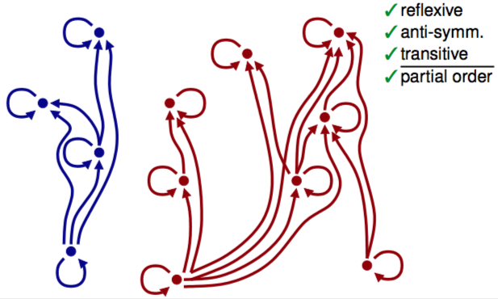
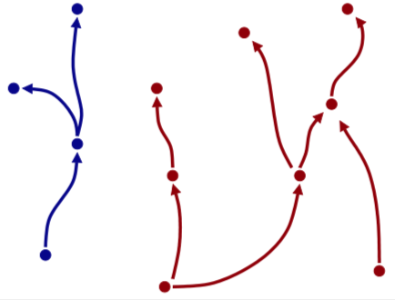
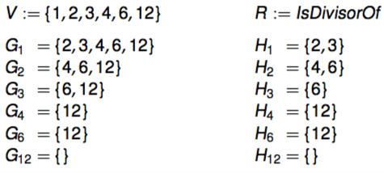
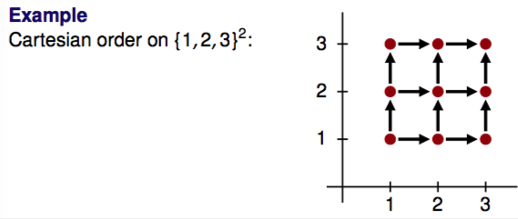
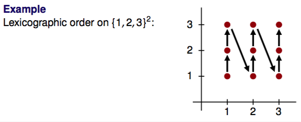

+++
title = 'Partial orders'
+++
# Partial orders
partial order on V: relation R of type V × V. satisfies reflexivity, anti-symmetry, transitivity

example: relation ≤ is partial order on N

- ∀n: n ≤ n (reflexivity)
- ∀m, n: m≤n ∧ n≤m ➝ m = n (anti-symmetry)
- ∀k, m, n: k≤m ∧ m≤n ➝ k≤n (transitivity)

example: the relation ⊆ is partial order on P(V)

- ∀A: A ⊆ A (reflexivity)
- ∀A,B: A ⊆ B ∧ A ➝ A = B (anti-symmetry)
- ∀A,B,C: A ⊆ B ∧ B ⊆ C ➝ A ⊆ C (transitivity)

## linear ordering relations
partial order R on set V, then:

- x, y ∈ V are _comparable_ if x R y or y R x
- R is _linear/total order_ if all x,y ∈ V are comparable

e.g. relation ≤ on N: for all n,m in N — n ≤ m or m ≤ n — _total_

e.g. relation ⊆ on P({1,2}): {1} is not a subset of {2}, {2} is not a subset of {1} — _not total_

## strict partial ordering relations

if partial order R on set V, then strict partial order S corresponding to R is defined by

x S y ⟷ x R y and x ≠ y

a strict partial order is irreflexive, anti-symmetric, transitive

## Hasse diagrams
apparently a partial ordering relation is complicated as fuck:

so get rid of some arrows and make a Hasse diagram — omit reflexivity and transitivity

the arrows create chains that split and merge, elements in the same chain are comparable

Algorithm:
1. For all x ∈ V — Gx := {y : y ≠ x and x R y}
2. For all x ∈ V — Hx := Gx \ {z : z ∈ Gy for a y ∈ Gx}
3. For all x ∈ V — draw and arrow from x to every y ∈ Hx

example:

## Cartesian order on A × B
\<a1, b1\> ≤ \<a2, b2\> ⟷ a1 ≤A a2 and b1 ≤B b2

ordered by points, if both are smaller

cartesian order on A × B is a partial order

## Lexicographic order on A × B
\<a1, b1\> ≤ \<a2, b2\> ⟷ (a1 \<A a2) ∨ (a1 = a2 ∧ b1 ≤B b2)

like in a dictionary

lexicographic order on A× B is a partial order, total if ≤A on A and ≤B on B are total

## Minimal and maximal elements
(V, ≤) is a partially ordered set, A ⊆ V, m ∈ A

m is:

- largest element of A — if ∀a ∈ A : a ≤ m
- smallest element of A — if ∀a ∈ A : m ≤ a
- maximal element of A — if ∀a ∈ A : (M ≤ a ➝ m = a) — no outgoing arrows on Hasse diagram
- minimal element of A — if ∀a ∈ A : (a ≤ m ➝ a = m) — no incoming arrows on Hasse diagram

Every maximum of A is a maximal element of A.
If A has a maximum, it is the only maximal element.
