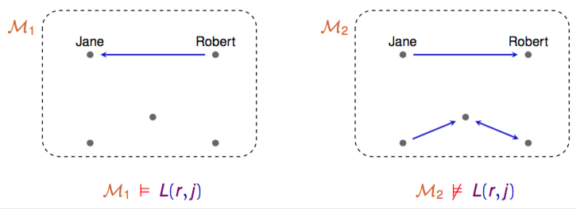

+++
title = 'Predicate Logic'
+++
# Predicate Logic
## Atomic formulas

role of propositional vars p,q,r is taken over by atomic formulas with objects and predicates

C(j)

- C is a unary predicate symbol
- can mean e.g. Jane (j) is clever (C)

K(a,b)

- K is a binary predicate symbol
- can mean e.g. A knows B
- A and B are objects a and b

## Quantifiers
∃x C(x) — somebody is clever

∀x C(x) — everybody is clever

same priority level as for ¬

## Models
if L(r,j) means Robert loves Jane, it holds in M1 but not M2

meaning/truth value of a formula from predicate logic depends on underlying model M, consisting of:

- set A of elements
- interpretation of constants (r, j)
- interpretation of predicate symbols (L, C, K)

∀x ϕ is true in M if true for *every* element in A

∃x ϕ is true in M if true for *some* element in A

for each e ∈ A, ϕ [x := e] is true in M

## Semantic entailment
for formula ϕ, M ⊨ ϕ means that ϕ is true in M

- tautology — true in all models
- contradiction — false in all models
- contingent — true in some model, false in another
- satisfiable — true in some model

## Semantic equivalence
1. if for all models M, M ⊨ ϕ ⟷ M ⊨ Ψ
2. then ϕ ≡ Ψ

also, given that “nobody is perfect”, this holds:
> ¬∃x P(x) ≡ ∀x ¬P(x)

## Alpha conversion
you can rename bound variables like in lambda calc
> ∀x C(x) ≡ ∀y C(y)
