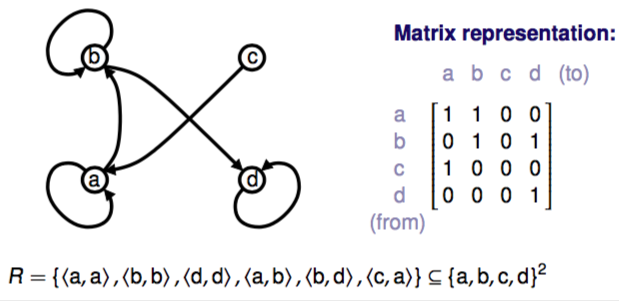
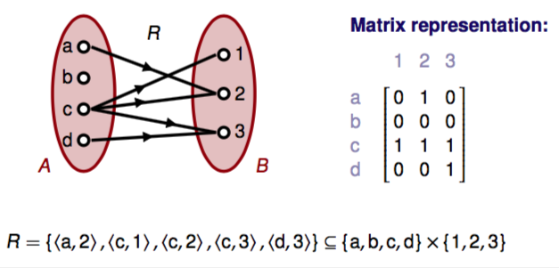
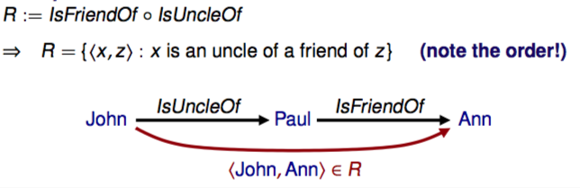
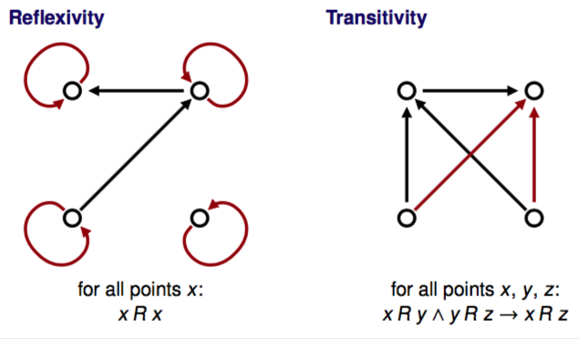
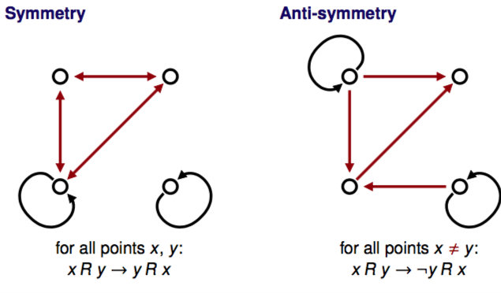

+++
title = 'Relations'
+++
# Relations
## Cartesian product of sets

A × B := {<a,b> : a ∈ A ∩ b ∈ B}

A × A := A2

#(A×B) = #A ⋅ #B

**Binary relation:** relation of type A × B or A × A

**Relation in set A:** relation of type A × A

## Infix notation:
x R y — <x, y> ∈ R

## Visualisation
directed graphs & matrix:

Venn diagrams & matrix:

## Inverse of binary relation
Inverse of R: R-1 := {<x,y> : <y,x> ∈ R}

R ⊆ A × B => R-1 ⊆ B × A

For Venn diagrams, you reverse the arrows.

## Composite relations
R ∘ S := {<x,z> : x S y ∩ y R z for some y}

Composition is associative.

Inverse: (R ∘ S)-1 = S-1 ∘ R-1

## Properties of relations

