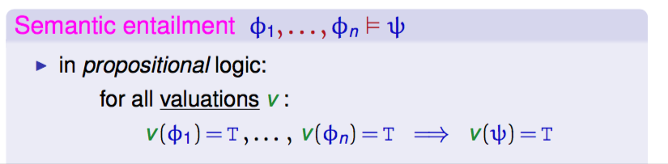
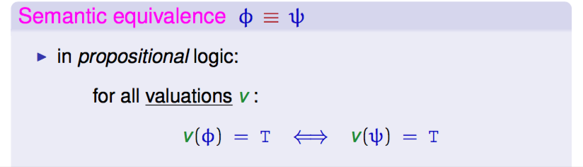

+++
title = 'Semantic entailment'
+++
# Semantic entailment
ϕ₁, …, ϕn ⊨  Ψ

A formula Ψ is semantically entailed by premises (ϕ₁, …, ϕn) if every valuation that makes premises true makes Ψ true.

counterexample makes premises true but not conclusion

if ϕ ⊨ Ψ and Ψ ⊨ ϕ, ϕ ≡ Ψ

