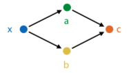
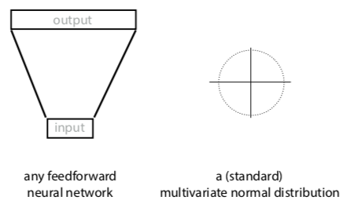

+++
title = 'Deep learning'
template = 'page-math.html'
+++
# Deep learning
## Deep learning systems (autodiff engines)

### Tensors

To scale up backpropagation, want to move from operations on scalars to tensors.

Tensor: generalisation of vectors/matrices to higher dimensions. e.g. a 2-tensor
has two dimensions, a 4-tensor has 4 dimensions.

You can represent data as a tensor. e.g. an RGB image is a 3-tensor of the red,
green, and blue values for each pixel.

### Functions on tensors

Functions have inputs and outputs, all of which are tensors.

They implement:

-   `forward(...)`: computing outputs given the inputs
-   `backward(...)`: computing gradients over inputs, given gradients over
    outputs

The modules we chain together are defined in a computation graph:

A deep learning system uses this graph to execute a computation (forward pass),
and does backpropagation to compute gradients to data nodes wrt the output
(backward pass).

Autodiff engine

-   Perform computation by chaining functions
-   keeps track of all computation in a computation graph
-   when computation done, walk backward through computation graph for
    backpropagation
-   eager evaluation: build graph as we perform computation

## Backpropagation revisited

Functions can have any number of inputs and outputs, which must be tensors.

The final output must be a scalar (i.e. always take derivative of scalar
function).

### Multivariate chain rule

How do you take derivatives when variables aren't scalars?

Multiple inputs:

How do you find the derivative with two inputs? Use the multivariate chain rule,
i.e. take single derivative for each input and then sum them.

$\frac{\partial c}{\partial x} = \frac{\partial c}{\partial a} \frac{\partial a}{\partial x} + \frac{\partial c}{\partial b} \frac{\partial b}{\partial x}$

### Backpropagation with tensors - matrix calculus

Start with scalar derivatives: one output over one input (just pick a random
one)

Tensor derivative: put all possible scalar derivatives into a tensor.

But how to arrange/order the tensor?

Solution: accumulate the gradient product.

forward(x): given input x, compute output y

backward(ly): given $l_{y} = \frac{\partial loss}{\partial y}$, compute
$\frac{\partial loss}{\partial y} \frac{\partial y}{\partial x}$.

convention: gradient of A has same shape as A

#### Example:

Let:

-   k = Wx + b
-   forward(W, x, b): compute Wx + b
-   backward(lk): compute $\frac{\partial l}{\partial k} \frac{\partial k}{\partial
    W}, \quad \frac{\partial l}{\partial k} \frac{\partial k}{\partial x}, \quad
    \frac{\partial l}{\partial k} \frac{\partial k}{\partial b}$

Steps:

1.  work out scalar derivative: $\frac{\partial l}{\partial k} \frac{\partial
k}{\partial W_{23}}$
2.  apply multivariate chain rule $\frac{\partial l}{\partial k} \frac{\partial
k}{\partial W_{23}} = ... = \frac{\partial l}{\partial k_{2}} x_{3}$
3.  now we know that $\frac{\partial l}{\partial k} \frac{\partial k}{\partial W_{ij}} =
\frac{\partial l}{\partial k_{i}} x_{j}$
4.  so, $\frac{\partial l}{\partial k} \frac{\partial k}{\partial W} = \frac{\partial
l}{\partial k} x^{T}$

## Making deep neural nets work

### Overcoming vanishing gradients

If weights of network are initialized too high, activations will hit rightmost
part of gradient, so local gradient for each node will be very close to zero. So
network won't start learning.

If they are too negative, then hit leftmost part of sigmoid, and get the same
problem.

ReLU preserves derivatives for nodes whose activations it lets through.  Kills
derivatives for nodes that produce negative value, but as long as network is
properly initialised, around half of values in batch will always produce
positive input for ReLU.

Still risk that durin training, the network will move to configuration where
neuron always produces negative input for every instance in data.  In that case,
end up with a dead neuron - its gradient will always be zero, no weights below
that neuron will change anymore (unless they also feed into a non-dead neuron).

Initialization:

-   assume that the layer input is roughly distributed so that its mean is 0 and
    variance is 1 in every direction (standardise/normalise data so this is true
    for first layer)
-   initialisation designed to pick a random matrix that keeps these properties
    true

### Minibatch gradient descent

Like stochastic gradient descent, but with small batches of instances, instead
of single instances.

-   smaller batches: close to stochastic gradient descent, more noisy, less
    parallelism
-   bigger batches: more like regular gradient descnet, more parallelism, limit
    is memory

In general, stay between 16 and 128 instances.

### Optimizers

#### Momentum

If gradient descent is a hiker in a snowstorm, moment gradient descent is a
boulder rolling down the hill.

Gradient doesn't affect its movement directly, but acts as a force on moving
object. If gradient is zero, updates continue in the same direction, but slowed
down by a 'friction constant' (μ).

Regular gradient descent: $w \leftarrow w - \eta \nabla loss(w)$

With momentum:

-   $v \leftarrow \mu v - \eta \nabla loss(w)$
-   $w \leftarrow w + v$

#### Nesterov momentum

In regular momentum, actual stem taken is sum of two vectors: the momentum step
(in direction we took last iteration) and gradient step (in direction of
steepest descent at current point)

This evaluates gradient after the momentum step, since we are taking that step
anyway. Makes the gradient a bit more accurate.

#### Adam

Combines idea of momentum with idea that each weight should have its own
learning rate.

Normalize gradients: keep running mean m and uncentered variance v, for each
parameter over the gradient. Subtract these instead of the gradient.

Calculations:

-   $m \leftarrow \beta_{1} * m + (1 - \beta_{1}) \nabla loss(w)$
-   $v \leftarrow \beta_{2} * v + (1 - \beta_{2}) (\nabla loss(w))^{2}$
-   $w \leftarrow w - \eta \frac{m}{\sqrt{v} + \epsilon}$

### Regularizers

The bigger your model is, the bigger the capacity for overfitting.

Regularizers pull the model back towards simpler models, but don't eliminate
more complex solutions.

#### L2 regularizer

"Simpler means smaller parameters"

Take all params, stick them in one vector ("θ"). Then $loss_{reg} = loss +
\lambda \|\theta\|$

Models with bigger weights get higher loss, but if it's worth it (i.e.  original
loss decreases enough), they can still beat simpler models.

If you have a bowl where you want to roll a marble to the lowest point, L2 loss
is like tipping the bowl slightly to the right (shifting the lowest point).

#### L1 regulariser

"Simpler means smaller parameters and more zero parameters"

lp norm: $\|\theta\|^{p} = \sqrt[p]{w{p}+b{p}}$ $loss \leftarrow loss +
\lambda \|\theta\|^{1}$

If you have a bowl where you want to roll a marble to the lowest point, L1 loss
is like using a square bowl -- if it has groves along dimensions, marble is
likely to end up in one of the grooves.

#### Dropout regularisation

"Simpler means more robust; during training, randomly disable hidden units"

During training, remove hidden and input nodes, each with probability p.  This
prevents co-adaptation -- multiple neurons firing together in specific
combinations.

The analogy is if you can learn how to do a task repeatedly whilst drunk, you
should be able to do the task sober. So basically, do all of the practice exams
while drunk, and then you'll ace the final while sober (or you'll fail and
disprove all of machine learning, choose your destiny). But if anyone asks, I
didn't tell you to do that.

## Convolutional neural networks

Disclaimer: I'm gonna revise these notes, the prof basically covered all of CNN
theory in ten minutes lol. So I don't have much here atm.

Hidden layer has shape of another image, with more channels.

Hidden nodes only wired to nearby nodes in the previous layer.

Weights are shared, each hidden node has same weights as the previous layer.

Maxpooling reduces image dimensions.

## Deep learning vs machine learning

In ML, you chain things together. But chaining modules that are 99% accurate
doesn't mean the whole pipeline is 99% accurate, as error accumulates.

In deep learning, make each module differentiable - ensure that we can work out
**local** gradient, so we can train pipeline as a whole using backpropagation.
This is "end-to-end learning".

It's a lower level of abstraction, giving you smaller building blocks.

## Generators

Visual shorthand:

How do you turn neural network into probability distribution?

-   option 1: take output and interpret it as parameters of multivariate normal (μ, Σ)
    -   if output has high dimensions, take Σ to be diagonal matrix
    -   allows network to communicate how sure it's about the output (i.e. smaller variances in Σ mean it's more sure)
    -   allows sampling from the generator, and computing prob density x
-   option 2: start with an MVN, sample vector from it, feed that vector to the NN, and look at what comes out
    -   cannot easily compute prob density for an instance

    -   can easily sample

        
-   option 3: both. i.e., sample input from standard MVN, interpret output as another MVN, then sample from that.
    -   input is called z
    -   space of inputs is the latent space
    -   naive approach: sample random point from data, sample point from model, train on how close they are. loss could be any distance between tensors, like mean-square error
        -   doesn't work -- mode collapse.
        -   if a generated point is close to a mode, the model should be rewarded, but since it's also far away from some other points, we might compute the loss to a different point
        -   the different modes (areas of high prob) of data distr end up being averaged into a single point
        -   we want network to imagine details, not average over all possibilities

    

How do you 'fix' mode collapse?

## Generative adversarial networks

If you can generate adversarial examples (i.e. try to break your network), you can also add them to the dataset and then retrain your network.

Generator: takes input sampled from standard MVN, produces image

Discriminator: takes image, classifies as Pos (real) or Neg (fake)

### Vanilla GANs

Training discriminator:

-   feed examples from positive class
-   train it to classify them as Pos (just nudge the weights with backpropagation)
-   sample images from generator, train it to make them negative

Training generator:

-   freeze discriminator
-   train weights of generator to produce images that the discriminator labels as positive

### Conditional GANs

If we want network to generate output probabilistically. i.e., the network has to fill in realistic details.

Make the generator a function, taking input and mapping it to output. Uses randomness to imagine specific output details.

Feed discriminator:

-   either input/output pair from data, which it should classify as real
-   or input from data with output generated by generator, which it should classify as fake

Training generator in two ways:
<ol type="a">
  <li>freeze weights of discriminator, train generator to produce stuff that the discriminator will classify as real</li>
  <li>feed it an input from data, backpropagate on corresponding output using L1 loss</li>
</ol>

Only works if input and output matched; for some tasks, only have unmatched bags of images in two domains. Can't randomly match because mode collapse. So what do?

### CycleGAN

Add "cycle consistency term" to loss function.

E.g. in horse-to-zebra example, if transform horse to zebra and back, result should be close to original image.

So, new goal:

-   train horse-to-zebra transformer and zebra-to-horse transformer, such that
-   horse-discriminator can't tell generated horses (and zebras) from real ones
-   cycle consistency loss for both combined is low

Think of generators doing steganography (hiding info in pictures). For example, hiding a horse inside a zebra (picture, obviously).

### StyleGAN

Feed the network the latent vector at each layer.

Since deconvolution starts with low resolution, high level description of image, feeding it latent vector at each layer allows it to use different parts of the vector to describe different aspects of the image ("styles").

Network also receives separate extra random noise per layer, which allows it to make random choices.

Then generate image for destination, but for a few layers (bottom, middle, or top) we use source latent vector instead.

### What can we do with a generator?

Gotta fill this in.

## Autoencoders

A type of neural network that tries to make output as close to input as possible, but there is a middle layer (smaller than input) that functions as a bottleneck.

After network is trained, that layer becomes a compressed representation of the input.

blue layer is latent representation of input. If autoencoder works well, expect to see similar images clustered together.

To find direction in latent space that we can use to make someone smile, we label instances as smiling and nonsmiling, and draw vector between their respective means. That's called the smiling vector (god I can't take this shit seriously)

### Turning an autoencoder into a generator

How:

-   train an autoencoder
-   encode the data to latent variables Z
-   fit MVN to Z
-   sample from the MVN
-   "decode" the sample

But we're training for reconstruction error, and then turning result into autoencoder. Can we train for maximum likelihood directly?

## Variational autoencoders

Force decoder to also decode points near z correctly, and force latent distribution of data towards N(0,1). Can be derived from first principles.

Approximate P(z \| z,θ) with neural network, and make that the q function.

Want to choose parameters θ (weights of neural network) to maximise log likelihood of data.

$\ln{P(x|\theta)} = L(q, \theta) + KL(q,p)$ with $P = P(z|x,\theta)$.

-   q(z\|x) any approximation to P(z\|x)
-   KL(q, p) - Kullback-Leibler divergence
-   $L(q, \theta) = E_{q} \ln{\frac{P(x,z|\theta)}{q(z|x)}}$

We can't marginalize out hidden variable z, or compute probability over z given x. Instead, use approximation on prob of z given x, called q, and optimise both probability of x given z and z given x.

Solves mode collapse, because we map input to latent space and back to data space, so we know which instance the generated output should look like.

Sorry guys this lecture was hard to follow, I'll finish this part up when I revise for exams.
