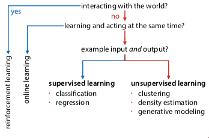

+++
title = 'Introduction'
template = 'page-math.html'
+++
# Introduction
## What is ML?
Deductive vs inductive reasoning:

  * Deductive (conclusion by logic): discrete, unambiguous, provable, known rules
  * Inductive (conclusion from experience): fuzzy, ambiguous, experimental, unknown rules

ML lets systems learn and improve from experience without being explicitly programmed (for a specific situation).

Used in software, analytics, data mining, data science, statistics.

Problem is suitable for ML _if we can't solve it explicitly_.

  * when approximate solutions are ok
  * when reliability is not the biggest focus

Why don't we have explicit solutions? Sometimes could be expensive, or could change over time, or other reasons.

An intelligent agent:

  * online learning: acting + learning simultaneously
  * reinforcement learning: online learning in a world based on delayed feedback

Offline learning: separate learning and acting

  * take fixed dataset of examples
  * train model on that dataset
  * test the model, and if it works, use it in prod

## Supervised ML
Supervised: explicit examples of input and output. Learn to predict output for unseen input.

learning tasks:

  * classification: assign class to each example
  * regression: assign number to each example

### Classification
how do you reduce a problem to classification? e.g. every pixel in a grayscale image is a feature, label each feature

classification: output labels are classes (categorical data)

linear classifier: just draw a line, plane, or hyperplane

  * feature space: contains features
  * model space: contains models. the bright spots have low loss.
  * loss function: performance of model on data, the lower the better

decision tree classifier: every node is a condition for a feature, go down branch based on condition. would look like a step function in a graph.

k-nearest-neighbors: lazy, doesn't do anything, just remembers the data (?? have to look this up in more detail)
features: numerical or categorical

binary classification: only have two classes

multiclass classification: more than two classes

### Regression
regression: output labels are numbers. the model we're trying to learn is a function from feature space to ℜ

loss function: maps model to number that expresses how well it fits the data

common example: $loss(p) = \frac{1}{n} \sum_i (f_p (x_i) - y_i)^2$

takes difference between model prediction and target value (residual), then square and sum all residuals

overfitting: the model is too specific to the data, it's memorizing the data instead of generalizing

split test and training data. don't judge performance on training data, the aim is to minimise loss on _test_ data.

## Unsupervised ML
Unsupervised: only inputs provided, find _any_ pattern that explains something about data.

learning tasks:

* clustering: classification, except no target column, so model outputs cluster id
* density estimation: model outputs a number (probability density), should be high for instances of data that are likely. e.g. fitting prob distribution to data
* generative modeling: build a model from which you can sample new examples

## What isn't ML?
ML is a subdomain of AI.

* AI, but not ML: automated reasoning, planning
* Data Science, not ML: gathering, harmonising, and interpreting data
* Data mining is more closely related, but e.g. finding fraud in transaction networks is closer to data mining
* Stats wants to figure out the truth, whereas with ML it just has to work well enough, but doesn't necessarily have to be true

