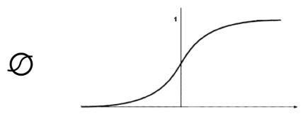
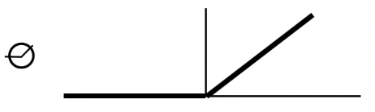
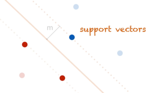
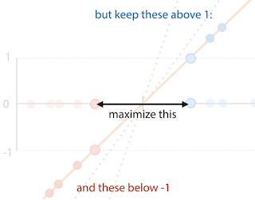

+++
title = 'Linear models'
template = 'page-math.html'
+++
# Linear models
## Defining a model

1 feature x: $f_{w,b}(x) = wx + b$

2 features x<sub>1</sub>, x<sub>2</sub>: $f_{w_1,w_2, b}(x_1, x_2) = w_1 x_1 + w_2 x_2 + b$

Generally,

$
\begin{aligned}
f_{w, b}(x) &= w_1 x_1 + w_2 x_2 + w_3 x_3 + ... + b \\
            &= w^T x + b \\
            &= \sum_{i} w_i x_i \\
            &= \|w\| \|x\| \cos{\alpha}
\end{aligned}
$

with w is vector w<sub>1</sub> to w<sub>n</sub>, x is x<sub>1</sub> to x<sub>n</sub>

with $w = \begin{pmatrix} w_1 \\ \dots \\ w_n \end{pmatrix}$ and $x = \begin{pmatrix} x_1 \\ \dots \\ x_n \end{pmatrix}$
## But which model fits best?

Define loss function, then search for model whihc best fits loss
function.

### Mean squared error loss
$\text{loss}_{x,y}(p) = \frac{1}{n} \sum_j (f_p (x<sup>j) - y</sup>j)^2$

Defines residuals that show how far from mean (?)

Why square? Make everything positive, but also penalize outliers

### Optimization & searching

$\hat p = \argmin_p \text{loss}_{x,y}(p)$

To escape local minima: add randomness, add multiple models

To converge faster: combine known good models (breeding), inspect the
local neighbourhood

#### Black box optimisation

Simple, only need to compute loss function, and a few more TODO
things

##### Random search

Start with random point p in model space.

```
loop:
  pick random point p' close to p
  if loss(p') < loss(p):
    p <- p'
```

You need to define what 'close to' means though.

Convexity: the property of having one minimum (i.e. if for any
two points, the line between those points is above the function)

The issue with random search is it can get stuck in a local
minimum. In many situations, local minima are fine, we don't
*always* need an algorithm for a guaranteed global minimum.

In discrete model spaces (which have a more graph-like
structure), you need to figure out a transition function.

##### Simulated annealing

'Improved' random search.

```
pick random point p' close to p
loop:
pick random point p' close to p

..etc TODO the lecturer was going fast as fuck
```

#####  Parallel search

Can also do these searches in parallel, or even parallel with
some communication between searches.

Population methods, eg. evolutionary algorithms:

```
start with population of k models
loop:
  rank population by loss
  remove the half with worst loss
  "breed" new population of k models
  optionally, add a little noise to each child
```

#####  Branching search

Coming closer to gradient descent:

```
pick random point p in model spce
loop:
  pick k random points {p_i} close to p
  p' <- argmin_p_i loss(p_i)
  if
TODO again he switched the fuckin slide
```

#### Gradient descent

Good, but doesn't help with global/local minima.

In 2D space, the tangent line is the slope. In higher spaces, the
plane/hyperplane is the gradient (analog of slope).

Gradient:
$\nabla f(x, y) = (\frac{\partial f}{\partial x}, \frac{\partial f}{\partial y})$

Tangent hyperplane: $g(x) = \nabla f(p)^T x + c$

Gives best approximation at point p.

The direction of steepest ascent:

$
\begin{aligned}
g(x) &= w^T x \\
      &= \|w\| \|x\| \cos{\alpha} \\
    \|x\| &= 1 \\
        &\rightarrow ||w|| \cos{\alpha}
\end{aligned}
$

The angle is maximised when cos(α) is 1, so α is 0. So the gradient
is the direction of steepest ascent

```
pick a random point p in model space
loop:
  p <- p - \eta \nabla loss(p)
```

Usually set η (step size, learning rate) between 0.0001 and 0.1.

Take partial derivatives of loss function, then calculate them.

Cons:

-   only works for continuous model spaces, with smooth loss
    functions, for which we can work out the gradient
-   does not escape local minima

Pros:

-   very fast, low memory
-   very accurate

If the model is linear, you don't actually need to search, you
could just set partial derivatives equal to zero and solve.

Sometimes the loss function shouldn't be the same as the evaluation
function, because you might not get a smooth function.

#### Classification losses
##### Least-squares loss
Apply the least-squares calculation, you get a smooth function.
Then you can do gradient descent.

## Neural networks (feedforward)

### Overview

Learns a feature extractor together with the classifier

Neuron has inputs (dendrites) and one output (axon) The simplified
version for computers is the \'perceptron\':

-   inputs are features (x)
-   multiply each input with a weight (w)
-   add a bias node (b)
-   y = w<sub>1</sub>x<sub>1</sub> + w<sub>2</sub>x<sub>2</sub> + b
-   output class A if y \> 0, otherwise class B

Nonlinearity:

-   sigmoid function $\sigma(x) = \frac{1}{1+e^{-x}}$

    

-   ReLU
    $r(x) = \begin{cases} x &\text{if } x > 0 \\ 0 &\text{otherwise} \end{cases}$

    

Feedforward network: a multilayer perceptron -- hidden layer(s) between
input and output layers

Every edge has weights, and the network learns by adapting the weights.

It trains both feature extractor and linear model at once.

### Classification

Binary:

-   add a sigmoid to the output layer
-   the result is then the probability that the result is positive given
    the input

Multiclass:

-   softmax activation:
-   for output nodes o: o<sub>i</sub> = w<sup>T</sup>h + b
-   then result $y_i = \frac{exp(o_i)}{\sum_{j}exp(o_{j})}$

### Dealing with loss - gradient descent & backpropagation

Stochastic gradient descent:

1.  Pick random weights w for the whole model
2.  loop:
    -   for x in X: $w \leftarrow w - \eta\nabla loss_{x}(w)$

For complex models, symbolic and numeric methods for computing the
gradient are expensive. Use backpropagation:

-   break computation down into chain of modules
-   work out local derivative of each module symbolically (like you
    would on paper)
-   do forward pass for a given input x. compute f(x), remember
    intermediate values.
-   compute local derivatives for x, and multiply to compute global
    derivative (because chain rule)

For feedforward network, you look at derivative of loss function with
respect to the weights

## Support vector machines (SVMs)

Uses a kernel to expand the feature space

Margin: line for which the space to the nearest positive and negative
points is as big as possible.

Support vectors: the points that the margin just touches



The support vector machine tries to find this line.

Objective of SVM:

-   maximize 2x the size of the margin
-   such that all positive points are either 1 or above 1, negative
    points are either at or below 1
-   hard margin SVM:
    -   minimize $\frac{1}{2} \|w\|$
    -   st y<sup>i</sup>(w<sup>T</sup>x<sup>i</sup> + b)  ≥ 1 for all x<sup>i</sup>
    -   but if data is not linearly separable, cannot satisfy this
        constraint
-   soft margin SVM:
    -   minimize $\frac{1}{2} \|w\| + C \sum_{i}p_{i}$, p<sup>i</sup>  ≥ 0
    -   st y<sup>i</sup>(w<sup>T</sup>x<sup>i</sup> + b)  ≥ 1 - p<sup>i</sup> for all x<sup>i</sup>



For loss, two options:

-   express everything in terms of w, get rid of constraints:
    -   allows gradient descent
    -   good for neural networks
    -   get SVM loss:
        -   p<sup>i</sup> = max (0, y<sup>i</sup>(w<sup>T</sup>x<sup>i</sup>+b)-1)
        -   $\frac{1}{2} \|w\| + C\sum_{i}\max{0, y<sup>i(w</sup>{T}x^{i}+b)-1}$
        -   no constraints
-   express everything in terms of support vectors, get rid of w
    -   doesn\'t allow error backpropagation
    -   allows the kernel trick:
        -   if you have an algorithm which operates only on dot product
            of instances, you can substitute the dot product for a
            kernel function.
        -   kernel function k(x<sup>i</sup>, x<sup>j</sup>) computes dot product of x<sup>i</sup>
            and x<sup>j</sup> in a high-dimensional feature space, without
            explicitly computing the features themselves
        -   polynomial kernel: k(a,b) = (a<sup>T</sup> b + 1)<sup>d</sup>
            -   feature space for d=2: all squares, all cross products,
                all single features
            -   feature space for d=3: all cubes and squares, all
                two-way and three-way cross products, all single
                features
        -   RBF kernel: $k(a,b) = exp(-\gamma \|a-b\|)$, feature space
            is infinite dimensional
    -   have to optimise under constraints: Lagrange multipliers
        -   minimize f(a) such that g<sub>i</sub>(a)  ≥ 0 for i  ∈ \[1, *n*\]
        -   $L(a, \alpha_{1}, ..., \alpha_n) = f(a) - \sum_{i} \alpha_{i}g_{i}(a)$
        -   solve $\nabla L = 0$ such that α<sub>I</sub>  ≥ 0 for i  ∈ \[1, *n*\]
    -   result:
        -   minimize $-\frac{1}{2} \sum_i \sum_j \alpha^i \alpha<sup>j y</sup>i y<sup>j k(x</sup>i, x^j) + \sum_i \alpha^i$
        -   such that 0 ≤ α<sup>i</sup> ≤ C; $\sum_i \alpha<sup>i y</sup>i = 0$

## Summary of classification loss functions


