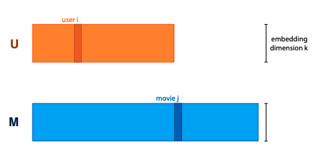

+++
title = 'Matrix models'
template = 'page-math.html'
+++
# Matrix models

## Recommender systems
using the example of movie recommendations for users.

Recommendation using only explicit info:
- we have no representation for users or movies, only 'atomic' objects that we want to compare for similarity
- we saw this with word embedding, represented each word by its own vector and optimised values of vectors

embedding models:
- train length k embedding for each user, and one for each movie, and arrange into matrices U and M.
- the matrices are parameters of the model

to make a prediction, define that dot product of user vector and movie vector should be high if user would like the movie.
this is a choice, but it's a logical one.

multiplying UT with M gives matrix of rating predictions for every user/movie pair.
so we want to take rating matrix R, and decompose it as product of two factors ("matrix factorization/decomposition")

## Matrix factorization
You get an optimisation problem: choose U and M st UT M ≈ R.

$\begin{aligned}
\argmin_{U,M} &= \| R - U^T M \|_{F}^{2} \\
&= \sum_{i,j} (R_{ij} - \lbrack U^T M \rbrack_{ij})^2 \\
&= \sum_{i,j} (R_{ij} - u_{i}{T} m_j)2
\end{aligned}$

but, R is not complete, for most user/movie pairs we don't know the rating.
so, sometimes it's better to only optimise for known ratings:

$\begin{aligned} \argmin_{U,M} \sum_{i,j \in R_{\text{known}}} (R_{ij} - u_{i}{T} m_j)2 \end{aligned}$

Alternating least squares - alternative to gradient descent
- idea: if we know M, computing U is easy, and vice versa
- so, starting with random U and m:
    - fix M, compute new U
    - fix U, compute new M

Stochastic gradient descent is usually more practical.

If we only have positive ratings, we have two options:
- ensure that UT M always represent probabilities; maximise probability of data.
- sample random movie user pairs as negative training samples (i.e., assume that users don't really know)

### Bias control
- control for user bias
    - ratings depend between users, they're subjective (no shit)
    - if we can explicitly model bias of a user, the matrix factorisation only needs to predict how much a user would deviate from their average rating for a particular movie
- control for movie bias
    - some movies are universally hated, some are universally loved
    - unpopular opinion: The Rise of Skywalker wasn't really that bad
- control for temporal bias
    - data is not stable over time
    - e.g. meaning of specific ratings can change
    -
For user/movie biases, use an additive scalar, which is learned along with embeddings.
One for each user, one for each movie, and one general bias over all ratings.

Make the biases and embeddings time dependent.
e.g. cut time into a small number of chunks, learn separate embedding for each chunk.

### The 'cold start' problem
When a user/movie is added to the database, we have no ratings, so matrix factorization can't build an embedding.
Have to rely on implicit feedback and side information.

Using implicit "likes" (e.g. movies watched but not rated, movies browsed, movies hovered over...)
- add separate movie embedding x, compute second user embedding
    - this is sum of x-embeddings of all movies user x has liked
- $u_{i}^{imp} = \sum_{j \in N(i)} x_j$
- add this implicit feedback embedding to existing one before computing dot product

Using side info (age, login, browser resolution...)
- for simplification, assume all features are binary
- assign each feature an embedding, sum over all features that apply to user, creating third user embedding
- $u_{i}^{side} = \sum_{f \in A(i)} y_f$
- then you add this before computing dot product

## Graph models
graph convolutional network:
- start with node embeddings N₀
- compute new embedding for each node: average of neighbor embeddings and its own - AN₀
- multiply by weight matrix W, add activation - N₁ = σ(AN₀W)
- if you apply this multiple times, you get a multi-layered structure

Link prediction: assume graph is incomplete, try to predict which nodes should be linked.
We can treat this like a matrix factorization problem.
GCN: perform convolutions on embeddings, multiply them out to generate predictions, compare to training data, and backpropagate loss

Node classification: for each node, try to predict a label.
With node embeddings, we can use a regular classifier, but how do we get good embeddings?
GCN for classification: ensure embedding size of last layer is equal to number of classes, apply softmax activation to embeddings, interpret them as probabilities over classes

GCN issues:
- depth is a problem, high connectivity diffuses info
- usually full-batch, can't easily break up graph into minibatches
- pooling not selective, all neighbors mixed equally before weights are applied

## Validating embedding models
inductive vs transductive learning: in transduction, learning is allowed to see features of all data, but labels of only training data.
embedding models only support transductive learning; if we don't know objects until after training, won't have embedding vectors.
like with graph models, we need to know the _whole_ graph.

to evaluate matrix factorization, give training alg all users and movies, but withhold some ratings.
same for links in a graph.
for node classification, give the alg the whole graph, and table linking node ids to labels, but withhold some labels.
