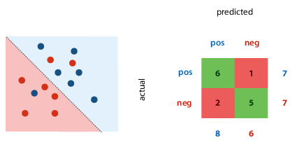
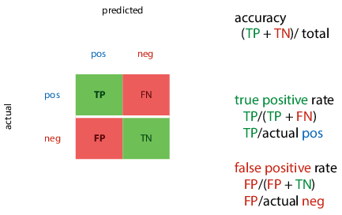
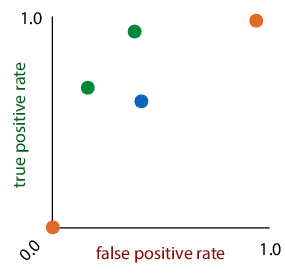
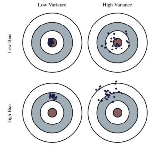

+++
title = 'Methodology'
template = 'page-math.html'
+++
# ML: Methodology

## Performing an experiment

Never judge your performance on the training data (or you'll fail the
course and life).

The proportion of training to test data is not important, the _absolute
size_ of the test data is. Aim to have min 500 examples in
test data (ideal 10 000 or more).

### What if you need to test many models?

e.g. k-nearest neighbours, which classifies a point based on the
classification of its k nearest neighbours.

### The modern recipe

1.  Split data into train, validation, and test data. Sample randomly,
    at least 500 examples in test set.
2.  Choose model, hyperparameters, etc. only based on the training set.
    Test on validation. Don't use test set for anything.
3.  State the hypothesis.
4.  During the final run, train on training + validation data.
5.  Test hypothesis _once_ on the test data. Usually at the
    very end of the project, when you write report/paper.

Don't re-use test data:

-   you'd pick the wrong model
-   it would inflate your performance estimate

For temporal data, you'll probably want to keep the data ordered by
time.

Which hyperparameters to try?

-   trial-and-error (via intuition)
-   grid search: define finite set of values for each hyperparam, try
    all combinations
-   random search

### Cross-validation

You still split your data, but every run, a different slice becomes the
validation data. Then you average the results for the final result.

If it's temporal data, you might want to do walk-forward validation,
where you always expand your data slices forward in time.

## What to report

### Classification

#### What's a good error (5%)?

It depends, just like in every class so far:

-   Class imbalance: how much more likely is a positive example than a
    negative example?
-   Cost imbalance: how much worse is mislabeled positive than
    mislabeled negative? e.g. how bad is it to mark a real email as spam
    vs letting a spam message into your inbox?

#### Performance metrics

##### Confusion matrix (contingency table)

Metrics for a single classifier.

The margins give four totals: actual number of each class present in
data, number of each class predicted by the classifier.

##### Precision and recall

Also for a single classifier.

-   Precision: proportion of returned positives that are
    _actually_ positive
-   Recall: proportion of existing positives that the classifier found

You can then calculate rates:

-   True positive rate (TPR): proportion of actual positives that we
    classified correctly
-   False positive rate (FPR): proportion of actual negatives that we
    misclassified as positive

ROC (receiver-operating characteristics) space: plot true positives
against false positives. the best classifier is in the top left corner.

Ranking classifier: also gives score of how negative/positive a point
is.

-   turning classifier into ranking classifier:
    -   for linear classifier, measure distance from decision boundary,
        and now you can scale classifier from timid to bold by moving
        the decision boundary
    -   for tree classifier: sort by class proportion in each segment
-   ranking errors: one per every pair of instances that's ranked
    wrongly (a negative point is ranked more positively than a positive
    point)

Coverage matrix: shows what happens to TPR and FPR if we move threshold
from right to left (more or less identical to ROC space)

If we draw line between two classifiers, we can create classifier for
every point on that line by picking output of one of the classifiers at
random. E.g. with 50/50 probability, end up halfway between the two. The
area under the curve of classifiers we can create ("convex hull") is
good indication of quality of classifier -- the bigger this area, the
more useful classifiers we can achieve. Good way to compare classifiers
with class or cost imbalance, if we're unsure of our preferences.

### Regression

Loss function: mean squared errors
($\frac{1}{n} \sum_i (\hat{y_i} - y_i)^2$)

Evaluation function: root mean squared error
($\sqrt{\frac{1}{n} \sum_i (\hat{y_i} - y_i)^2}$)

-   you may want to report this, because minimised at same places as MSE,
    but has same units as the original output value, so easier to
    interpret

Bias: distance from true MSE (which is unknown) to the optimum MSE.

-   high bias: model doesn't fit generating distribution.
    "underfitting"
-   reduce by increasing model capacity or features

Variance: spread of different experiments' MSE around the true MSE

-   high variance: high model capacity, sensitivity to random
    fluctuations. "overfitting"
-   reduce by reducing model capacity, adding regularization, reducing
    tree depth

specifically for k-NN regression: increasing k increases bias and
decreases variance

Dartboard example:

### Errors & confidence intervals

Statistics tries to answer: can observed results be attributed to _real
characteristics_ of the models, or are they observed _by
chance_?

If you see error bars, the author has to indicate what they mean --
there's no convention.

Standard deviation: measure of spread, variance

Standard error, confidence interval: measure of confidence

If the population distribution is normal, the standard error of the mean
is calculated by $\frac{\sigma}{\sqrt{n}}$(because the
sample distribution is the t distribution)

Re confidence intervals: the correct phrasing is "if we repeat the
experiment many times, computing the confidence interval each time, the
true mean would be inside the interval in 95% of those experiments"

Use statistics in ML to show confidence and spread.

## The no-free-lunch theorem and principle

Answer to question "what is the best ML method/model in general?"

Theorem: "any two optimization algorithms are equivalent when their
performance is averaged across all possible problems"

i.e. you can't say shit in general.

A few outs:

-   universal distribution, the datasets for which our methods works are
    the likely ones
-   Occam's razor, the simplest solution/explanation is often the best

Principle: there is no single best learning method; whether an algorithm
is good depends on the domain

Inductive bias: the aspects of a learning algorithm, which implicitly or
explicitly make it suitable for certain problems make it unsuitable for
others

## Cleaning your data
### Missing data
Simplest way - remove features for which values missing. Maybe they're not important, probably, hopefully.

Or remove instances (rows) with missing data. The problem is if data wasn't corrupted uniformly, removing rows with missing values changes the data distribution. An example is if people refuse to answer questions.

Generally, think about the real-world use case -- can you also expect missing data there?
* if yes: keep them in test set, make a model that can consume them
* if no: try to get a test set without missing values, test methods for completing data only in the training set

Guessing the missing data ("imputation"):
* categorical: use the <dfn title="the value that occurs most often">mode</dfn>
* numerical: use the mean
* or, make the feature a target value and train a model

### Outliers
Are they mistakes?:
* Yes: deal with them.
* No: leave them alone, check model for strong assumptions of normally distributed data

Can we expect them in production?
* Yes: make sure model can deal with them
* No: remove them, get a test dataset representing production

Watch out for MSE, it's based on assumption of normally distributed randomness. If you get data with big outliers, it fucks up.

### Class imbalance
<def title="i.e. how much more likely is a positive example than a negative example?">Class imbalance</def> is a problem, but how do you improve training?
* Use a big test set
* Don't rely on accuracy -- try ROC plots, precision-recall plots, AUC, look at confusion matrix...
* Resample training data
  * oversample: sample with replacements. leads to more data, but creates duplicates and increases likelihood of overfitting.
  * undersample: doesn't lead to duplicates, but you throw away data. might be useful for multiple-pass algorithms
* Use data augmentation for minority class
  * oversample minority with new data derived from existing data
  * example: SMOTE, which finds small clusters of points in minority class, and generates their mean as new minority class point

## Choosing features
Even if data is a table, you shouldn't just use columns as features.
Some algorithms work only on numeric features, some only on categorical, some on both.

Converting between categoric/numeric:
* numeric to categoric - you're bound to lose information, but it might be tolerable
* categoric to numeric
  * integer coding: make everything an integer - imposes false ordering on unordered data. generally not a good idea.
  * one-hot coding: one categorical feature becomes several numeric features. for each element, you say whether or not the feature applies (0 or 1).

Expanding features: adding extra features derived from existing features (improves performance).
For example, when you have results that don't fit on a line, but _do_ fit on a curve, you can add a derived feature x².
If we don't have any intuition for extra features to add, just add all cross products, or use functions like sin/log.

## Normalisation & standardisation
Create a uniform scale.

### Normalisation
Fit to [0,1].
Scales the data linearly, smallest point becomes zero, largest point becomes 1:
$\chi \leftarrow \frac{\chi - \chi_{min}}{\chi_{max} - \chi_{\min}}$

### Standardisation
Fit to 1D standard normal distribution.
Rescale data so mean becomes zero, standard deviation becomes 1. Make it look like the data came from a standard normal distribution.
$\chi \leftarrow \frac{\chi - \mu}{\sigma}$

### Whitening
Fit to multivariate standard normal distribution.
If the data is correlated, you don't end up with a spherical shape after normalising/standardising. So you have to choose a different basis (coordinate system) for the points.

Back to linear algebra - choose a basis
$$B = \begin{bmatrix} c & d \end{bmatrix} = \begin{bmatrix} 1.26 & -0.3 \\ 0.9 & 0.5 \end{bmatrix}$$

Then if you want to convert a coordinate to this basis, multiply $Bx$. If you want to convert from this basis to the standard, multiply $B^{-1} x$.

Since the inverse of a matrix is computationally expensive, prefer orthonormal bases (the basis vectors are <def title="perpendicular to each other">orthogonal</def> and <def title="have length 1">normal</def>). Because then $B{-1} = BT$, and the transpose is much easier to compute.

Steps:
  1. Compute sample mean $m = \frac{1}{n} \sum_i x_i$ and sample covariance $S = \frac{1}{n-1} X X^T$ (where $X = [x_1, \dots, x_n] -m$).
  2. Find some A st $S = AA^T$:
    * Cholesky decomposition
    * Singular value decomposition
    * Matrix square root
  3. White the data: $x \leftarrow A^{-1} (x-m)$

So whitening means we choose new basis vectors for a coordinate system where the features are not correlated, and variance is 1 in every direction.
## Dimensionality reduction
Opposite of feature expansion - reducing number of features in data by deriving new features from old ones, hopefully without losing essential information.

Good for efficiency, reducing variance of model performance, and visualisation.

Principal component analysis (PCA): whitening with some extra properties. Afte applying, you throw away all but first k dimensions, and get very good projection of data down to k dimensions.
  1. Mean-center the data
  2. Compute sample covariance S
  3. Compute singular value decomposition: $UZU^T$
    * SVD is usually computed from X or A (set equal to X or A)
    * Z is diagonal, whose diagonal values sorted from largest to smallest are the eigenvalues.
    * U is an orthonormal basis, whose columns are the eigenvectors of A.
      * Eigenvectors: a matrix transforms vectors, with some getting stretched and rotated. If a vector only gets stretched/flipped, but its direction doesn't change, it's an eigenvector. Translating to math, if Au = λu, u is an eigenvector, and λ is its corresponding scalar eigenvalue.
  4. Transform data: $x \leftarrow U^T x$. To whiten, also divide by diag(Z)
  5. Discard all but first k features (keep only features corresponding to biggest eigenvectors)
