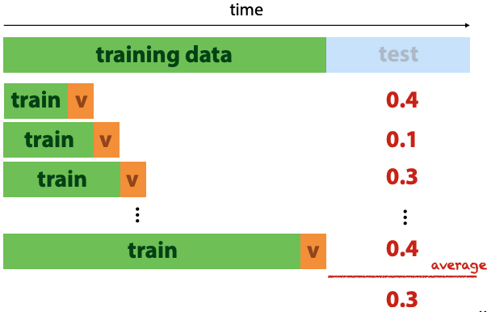
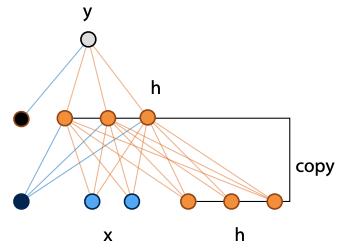
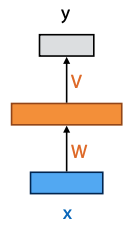
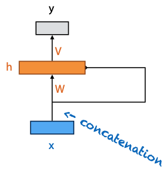
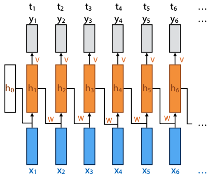
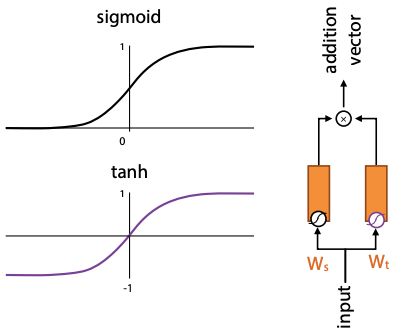

+++
title = 'Models for sequential data'
template = 'page-math.html'
+++
# Models for sequential data

## Sequences
They consists of numbers or symbols:
    - numeric 1 dimensional, e.g. stock price over time. can be n-dimensional
    - symbolic (categorical) 1-dimensional, like english sequence of words/characters. can be n-dimensional, with multiple categorical features per timestamp (like sheet music)

we could have one sequence per instance, and try to classify the sequences (like email spam/not spam)
or the whole dataset is a sequence, and instances are ordered.

single sequence feature extraction:
- make it a regression problem, each point is represented by the m values before it
- gives us a table with a target label (value at time t) and m features (the m preceding values)
- you could also use mean/variance statistics
- but shit: if the data is shuffled, the classifier is trained on data that comes from the future (relative to the test data)

major key: think about the real-world use case. e.g. if we want to predict future values, the training data shouldn't contain things that happen later than test data.

you can do walk-forward validation, if target labels have meaningful ordering in time:

When modelling probability, break the sequence into its tokens, like words in a sentence. Each token is modeled as a random variable (_not_ independent).
So you end up with joint distribution P(W₄, W₃, W₂, W₁) (with some arbitrary number of parameters.

Can apply chain rule of probability:

$\begin{aligned}
P(W_4, W_3, W_2, W_1) &= P(W_4, W_3, W_2 | W_1) P(W_1) \\
                      &= P(W_4, W_3 | W_2, W_1) P(W_2 | W_1) P(W_1) \\
                      &= P(W_4 | W_3, W_2, W_1) P(W_3 | W_2, W_1) P(W_2 | W_1) P(W_1)
\end{aligned}$

i.e.: can rewrite probability of sentences as product of probability of each word, with condition on its history.
with log probability, you get a sum: $\log{P(\text{sentence})} = \sum_{word} \log{P(\text{word} | \text{words before it})}$

## Markov models
Markov assumption: limit the amount of memory for previous tokens. e.g. retain a max of 2 words.
The "order" is the number of words retained in the conditional.

For example, if the conditional is $P(x | \text{i, will, graduate, in, a, decade})$ and it's a third-order model, the Markov assumption is $P(x | \text{i, will, graduate})$.

With Markov assumption and chain rule, can model sequence as limited-memory conditional probabilities. These can be estimated from a corpus (huge piece of text).

For example, to estimate prob of the word 'prize' given "won a", count how often "won a prize" occurs in text as proportion of total occurrences of "won a":

$P(\text{prize} | \text{a, won}) \approx \frac{\text{\# won a prize}}{\text{\# won a}}$

The word snippets are "n-grams". Three words is a trigram, two words is a bigram. I guess one word is just a gram. And maybe 1000 words would be a kilogram.

Sequential sampling: start with small seed of words, then sample next word according to its probability given the previous words.

## Embedding models
Model object x by embedding vector ex. The similarities of these vectors represent similarities between words.
Creates embedding vectors for words, where distances and directions reflect semantic meaning.

Distributional hypothesis: words that occur in same context often have similar meanings.

1-hot vector: represent words as atomic objects in a monolithic vector

Word2Vec:
- slide context window over sequence, trying to predict distribution P(y|x) - which words likely to occur in context window given middle word
- create dataset of word pairs from text
- feed this dataset to two-layer network, which predicts context
- softmax activation over 10k outputs is expensive, so need some tricks to make it feasible
- after training, discard second layer (softmax) and only use embeddings produced by first layer

## Recurrent neural networks
Neural network with cycles in it (used for sequences).

Can be used for:
- sequence to sequence, e.g. translating English to French
- sequence to label, e.g. sequence classification
- label to sequence, e.g. sentence generation

Example, fully connected network with input x extended by three nodes, to which the hidden layer is copied:

Visual shorthand:
- rectangle is vector of nodes
- arrow feeding into the rectangle annotated with a weight matrix means fully connected transformation
- if line doesn't have weight, it's a copy of input vector
- if two lines flow into each other, concatenate their vectors

 

Training RNNs:
- provide input seq x, target seq t
- backpropagation through time:
    - unroll:
        - every step in seq is applied in parallel to copy of the network
        - recurrent connection flows from previous copy to next
        - the whole thing is a feedforward net (network without cyles)
        - hidden layer inits to zero vector

        

Basic RNNs work well, but don't learn to remember information for a long time.
Can't have a long term mem for everything, need to be selective. In order to remember things long term, you need to forget a lot of other stuff (such is life).

## LSTMs
"Long short-term memory".
Selective forgetting and remembering, controlled by learnable "gates". Side note, from now on I'm not "studying", but I'm "selectively forgetting and remembering".

*[tanh]: sigmoid rescaled so its outputs are between -1 and 1

The gating mechanism takes two input vectors, which are combined with sigmoid and tanh activations.
It produces an additive value -- want to figure out how much of input to add to some other vectors.
The tanh is like a mapping of input to range(-1, 1) -- limits the effect of the addition vector.
The sigmoid is like a selection vector.

Basic operation of LSTM is a "cell". There are two recurrent connections between cells: the current output y, and the cell state C.

I don't yet know how much detail we need to know about this, so I'll fill it in later based on exam questions.

The prof's summary: "incredibly powerful language models. Tricky to train, very opaque." Yep, opaque and complicated, indeed.
