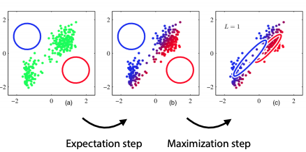

+++
title = 'Probability'
template = 'page-math.html'
+++
# Probability

## Probability basics

What even is probability?

-   Frequentism: probability is only property of repeated experiments
-   Bayesianism: probability is expression of our uncertainty and of our
    beliefs

### Probability theory

Definitions:

-   sample space: the possible outcomes, can be discrete or continuous
    (like real numbers)
-   event space: set of the things that have probability (subsets of
    sample space)
-   random variable: a way to describe events, takes values with some
    probability
    -   notation P(X = x) = 0.2 means that X takes the value x with
        probability 0.2
-   for random variables X and Y:
    -   joint probability P(X, Y): gives probability of each atomic
        event (specified single value for each random variable)
    -   marginal probability: if you sum a row/column of the joint
        distribution (also called "marginalizing out" a variable)
    -   conditional probability P(X | Y): probability of X given Y,
        i.e. the probability over one variable if another variable is
        known
-   independence: X and Y independent if P(X, Y) = P(X) P(Y)
-   conditional independence:
    -   X and Y conditionally independent if P(X | Y) = P(X)
    -   X and Y conditionally independent given Z if P(X, Y | Z) =
        P(X|Z) P(Y|Z)

Identities:

-   $P(x | y) = \frac{P(x \cap y)}{P(y)} = P(X,Y) P(Y) = \frac{P(y | x) P(x)}{P(y)}$
-   $P(x \cup y) = P(x) + P(y) - P(x \cap y)$

Maximum likelihood estimation:
$\hat{\theta} = \argmax_{\theta} P(X | \theta)$

Fitting a normal distribution:

$$\begin{aligned}
    \hat{\mu}, \hat{\sigma}  &= \argmax_{\mu, \sigma} P(X1, X2, ... | \mu, \sigma) \\
                            &= \argmax_{\mu, \sigma} \prod_i N(X^i | \mu, \sigma) \\
\end{aligned}$$

Probabilistic classifiers return a probability over all classes, given
features.

## (Naive) Bayesian classifiers

This is a generative classifier -- learn P(X|Y) and P(Y), apply Bayes
rule.

Choose class y that maximises P(y|x) -- the probability of class given
data. Then expand using Bayes' rule. Denominator doesn't affect which
class gets highest probability, so just fit models to P(x|y) and P(y)
to maximise quantity P(x|y)P(y).

$$\begin{aligned}
c(x)    &= \argmax_{y \in {pos,neg}}P(y|x) \\
        &= \argmax_{y \in {pos,neg}}\frac{P(x|y) P(y)}{P(x)} \\
        &= \argmax_{y \in {pos,neg}}P(x|y)P(y)
\end{aligned}$$

Bayes classifier:

-   choose probability distribution M (e.g. multivariate normal)
-   fit Mpos to all positive points: P(X=x | pos) = Mpos(x)
-   fit Mneg to all negative points: P(X=x | neg) = Mneg(x)
-   estmate P(Y) from class frequencies in the training data, or
    domain-specific information

Naive Bayes:

-   assume independence between all features, conditional on the class:
    $P(X_1, X_2 | Y) = P(X_1 | Y) P(X_2 | Y)$
-   but, if particular value doesn't occur, we estimate the probability
    to be 0. and since the whole estimate of probability is a long
    product, if a factor becomes zero, everything becomes zero.

Laplace smoothing:

-   for each possible value, add an instance where all features have
    that value (e.g. one row with all trues and one row with all falses)
-   avoids collapses due to zero values

## Logistic "regression" (classifier)

A discriminative classifier: learn function for P(Y|X) directly.

The logistic sigmoid:
$\sigma(t) = \frac{1}{1+e^{-t}} = \frac{et}{1+et}$

-   also, $1-\sigma(t) = \sigma(-t)$
-   fits results into interval \[0,1\]

Classifier: compute linear function, apply logistic sigmoid to result
$c(x) = \sigma(w \cdot x + b)$

Loss function: log loss ($-\log{P(class |features)}$)

-   maximum likelihood objective: find classifier q that maximises
    probability of true classes
-   points near decision boundary get more influence than points far
    away (least squares does the opposite)
-   also sometimes called "cross-entropy loss"

$$\begin{aligned}
  \argmax_q \prod_{C,x}q_x(C) &= \argmax_{q}\log{\prod_{C,x}q_x(C)} \\
                    &= \argmin_{q}-\log{\prod_{C,x} q_x (C)} \\
                    &= \argmin_q \sum_{C,x} - \log{q_x (C)} \\
                    &= \argmin_q - \sum_{x \in X_p} \log{q_x (P)} - \sum_{x \in X_N} \log{q_x (N)}
\end{aligned}$$

where:

-   x: some data point
-   qx: our classifier qx(C) = q(C|x)

Problem: if the classes are well separable linearly, there are many
suitable classifiers, and logistic regression has no reason to prefer
one over the other.

## Information theory

The relation between encoding information and probability theory.

Prefix-free trees assign prefix free code to set of outcomes. Benefit is
that no delimiters necessary in bit/codeword string.

Arithmetic coding - if allow L(x) (length of code for x) to take
non-integer values, we can equate codes with probability distributions.

Entropy of distribution: expected codelength of an element sampled from
that distribution.

$$\begin{aligned}
    H(p) &= E_p L(x) \\
         &= \sum_{x \in X} P(x)L(x) \\
         &= - \sum_{x \in X} P(x) \log{P(x)}
  \end{aligned}$$

Cross entropy: expected codelength if we use q, but data comes from p.

$H(p, q) = E_p L^q(x) = - \sum_{x \in X} p(x) \log{q(x)}$

Kulback-Leibler divergence: expected difference in codelength between p
and q. in other words, differencein expected codelength.

$KL(p,q) = H(p,q) - H(p) = - \sum_{x \in X} p(x) \log{\frac{q(x)}{p(x)}}$

### Maximum likelihood
The maximum likelihood is the model with the highest probability. Selects the model that is most suitable given the observed data.

(Log) likelihood: what we maximise to fit a probability model

Loss: what we minimise to find a machine learning model

### Normal distributions (Gaussians)
#### 1D normal distribution (Gaussian)
Has a mean μ and standard deviation σ.

Not a probability function, but a probability _density_ function. The only things on the graph that have probability are intervals, so to find probability, you integrate over the probability density function.

Definition: $N(x | \mu, \sigma) = \frac{1}{\sqrt{2\pi\sigma^{2}}} \exp{[ -\frac{1}{2\sigma^2} (x-\mu)^2 ]}$

Maximum likelihood for the mean:

$\begin{aligned}
         \argmax_{\theta} \log{p(x | \theta)} &= \argmax_{\theta} \ln{\prod_{x \in x} p(x|\theta)} \\
                                              &= \argmax_{\theta} \sum_{x}{\ln{p(x|\theta})}                                                                                  &&\text{(because product in log is sum outside of log)}\\
                                              &= \argmax_{\mu, \sigma} \sum_{x}\ln{\frac{1}{\sqrt{2\pi\sigma^2}}} \exp \big\lfloor -\frac{1}{2\sigma^2} (x-\mu)^2 \big\rfloor &&\text{(fill in the formula)}\\
                                              &= \argmax_{\mu, \sigma} \sum_{x}\ln{\frac{1}{\sqrt{2\pi\sigma^2}}} - \frac{1}{2\sigma^2} (x-\mu)^2 \\
\frac{\partial \ln P(x|\theta)}{\partial \mu} &= \sum_{x} \frac{\partial \big[ \ln{\frac{1}{\sqrt{2\pi\sigma^2}}} - \frac{1}{2\sigma^2} (x-\mu)^2 \big]}{\partial \mu}        &&\text{(because we want to maximise it)}\\
                                              &= -\frac{1}{2\sigma^2} \sum_{x} \frac{\partial (x-\mu)^2}{\partial \mu} \\
                                              &= -\frac{1}{\sigma^2} \sum_{x} (x-\mu) \\
         -\frac{1}{\sigma^2} \sum_{x} (x-\mu) &= 0                                                                                                                            &&\text{(because the max/min is where the derivative is 0)} \\
                             \sum_{x} (x-\mu) &= 0 \\
                          -\mu n + \sum_{x} x &= 0 \\
                                          \mu &= \frac{1}{n} \sum_{x} x                                                                                                       &&\text{(i.e. the arithmetic mean)}
\end{aligned}$

The implication is that the maximum likelihood estimator for the mean of normal distribution is the mean of the data.

#### Regression with Gaussian errors
For a regression $y = x^{T} w + b + E$, where $E \sim N(0, \sigma)$

If we want to maximise the likelihood of the parameters of the line, given some data:

$\begin{aligned}
\argmax_{w,b} P(Y|X,w,b) &= \argmax_{w,b} \ln{\prod_{i} N(y_i | x_{i}^{T} w + b, \sigma)} \\
                         &= \argmax_{w,b} \sum_{i} \ln{\frac{1}{\sqrt{2\pi\sigma^2}}} \exp \Big[ -\frac{1}{2\sigma2} (x_{i}{T} w + b - y_i)^2 \Big]  &&\text{(just fill in the formula)}\\
                         &= \argmax_{w,b} -\sum_{i} \frac{1}{2\sigma2} (x_{i}{T} w + b - y_i)^2                                                      &&\text{(because the ln doesn't matter for argmax)}\\
                         &= \argmax_{w,b} -\frac{1}{2} \sum_{i} (x_{i}{T} w + b - y_i)2                                                              &&\text{(because the stdev doesn't impact the result)}\\
                         &= \argmin_{w,b} \frac{1}{2} \sum_{i} (x_{i}{T} w + b - y_i)2                                                               &&\text{(which is the least squares function)}\\
\end{aligned}$

So that's why least squares assumes a normal distribution.
#### n-D normal distribution (multivariate Gaussian)
The formula: $N(x | \mu, \Sigma) = \frac{1}{\sqrt{(2\pi)^d |\Sigma |}} \exp \Big[ -\frac{1}{2} (x-\mu)^{T} \Sigma^{-1} (x-\mu) \Big]$

#### Gaussian mixture model
Basically, combine Gaussians to represent more complex shapes.

Example with three components:
- three components: N(μ₁, Σ₁), N(μ₂, Σ₂), N(μ₃, Σ₃)
- three weights: w₁, w₂, w₃ with $\sum w_{i} = 1$

Maximum likelihood:
$\argmax_{w_{i}, \mu_{i}, \Sigma_{i}} \sum_{x} {\ln \sum_{i}{ N(x | \mu_{i}, \Sigma_{i})}}$
### Expectation-maximisation
Finding maximum-likelihood is hard if there are hidden variables (not observed) that affect those that are in the dataset. For example, if the hidden variables come from mixture models (you don't know their specific distribution). This can be used to fit _any_ hidden variable model.

Key insight: can't optimise both θ and z, but given some θ, can compute P(z|x), and given z, can optimise θ.

Intuition:
1. Initialize components randomly
2. loop:
    - expectation: assign soft responsibilities to each point. i.e., points "belong" to each Gaussian "to some degree"; each Gaussian takes a certain _responsibility_ for each point.
    - maximisation: fit components to the data, weighted by responsibility.

Definition of "responsibility": $r_{x}^{i} = \frac{P(z=i | x)}{\sum_{j} P(z=j | x)}$
Model parameters, given responsibilities:
- $n_i = \sum_{x} r_{x}^{i}$
- $\mu_i = \frac{1}{n_i} \sum_{x} r_{x}^{i} x$
- $\Sigma_i = \frac{1}{n_i} \sum_{x} r_{x}^{i} (x-\mu_i) (x-\mu_i)^{T}$
- $w_i = \frac{n_i}{n}$

