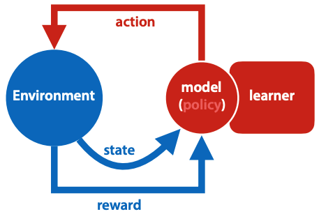
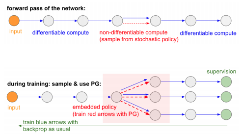

+++
title = 'Reinforcement learning'
template = 'page-math.html'
+++
# Reinforcement learning

## What is reinforcement learning?
Agent is in a state, takes an action.
Action is selected by policy - function from states to actions.
The environment tells the agent its new state, and provides a reward (number, higher is better).
The learner adapts the policy to maximise expectation of future rewards.

Markov decision process: optimal policy may not depend on previous state, only info in current state counts.



Sparse loss:
- start with imitation learning - supervised learning, copying human action
- reward shaping - guessing reward for intermediate states, or states close to good states
- auxiliary goals - curiosity, max distance traveled

policy network: NN with input of state, output of action, and a softmax output layer to produce prob distribution.

three problems of RL:
- non differentiable loss
- balance exploration and exploitation
    - this is a classic trade-off in online learning
    - for example, an agent in a maze may train to reach a reward of 1 that's close by and exploit that reward, and so it might never explore further and reach the 100 reward at the end of the maze
- delayed reward/sparse loss
    - you might take an action that causes a negative result, but the result won't show up until some time later
    - for example, if you start studying before an exam, that's a good thing.
      the issue is that you started one day before, and didn't do jack shit during the preceding two weeks.
    - credit assignment problem: how do you know which action takes the credit for the bad result?

deterministic policy - every state followed by same action.
probabilistic policy - all actions possible, certain actions higher probability.

## Approaches
how do you choose the weights (how do you learn)?
simple backpropagation doesn't work - we don't have labeled examples to tell us which move to take for given state.

### Random search
pick random point m in model space.

```
loop:
    pick random point m' close to m
    if loss(m') < loss(m):
        m <- m'
```

"close to" is sampled uniformly among all points with some pre-chosen distance r from w.
### Policy gradient
follow some semi-random policy, wait until reach reward state, then label all previous state-action pairs with final outcome.
i.e. if some actions were bad, on average will occur more often in sequences ending with negative reward, and on average will be more often labeled as bad.



$\nabla 𝔼_a r(a) = \nabla \sum_{a} p(a) r(a) = 𝔼_{a} r(a) \nabla \ln{p(a)}$, r is the ultimate reward at the end of the trajectory.

### Q-learning
If I need this, I'll make better notes, can't really understand it from the slides.

## Alpha-stuff
### AlphaGo
starts with imitation learning.
improve by playing against previous iterations and self. trained by reinforcement learning using policy gradient descent to update weights.
during play, use Monte Carlo Tree Search, with node values being the prob that black will win from that state.

### AlphaZero
learns from scratch, there's no imitation learning or reward shaping.
also applicable to other games like chess.

Improves AlphaGo by:
- combining policy and value nets
- viewing MCTS as policy improvement operator
- adding residual connections, batch normalization

### AlphaStar
This shit can play starcraft.

Real time, imperfect information, large diverse action space, and no single best strategy.
Its behaviour is generated by a deep NN that gets input from game interface, and outputs instructions that are an action in the game.

it has a transformer torso for units
deep LSTM core with autoregressive policy head, and pointer network.
makes use of multi-agent learning.
