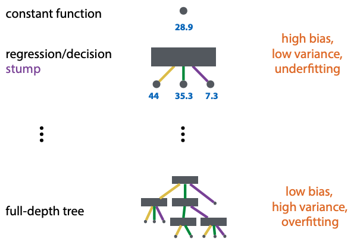
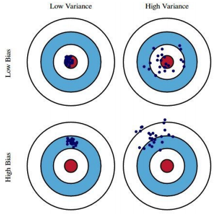

+++
title = 'Tree models and ensembles'
template = 'page-math.html'
+++
# Tree models & ensembles

## Tree models
### Decision trees (categorical)
Work on numerical and categorical features

Standard decision tree learning algorithm (ID3, C45):
- start with empty tree
- extend step by step
    - stop when: all inputs are same (no more features left), or all outputs are same (all instances same class)
- greedy (no backtracking)
- choose the split that creates least uniform distribution over class labels in the resulting segmentation
    - entropy is measure of uniformity of distribution
    - recall, entropy $H(p) = - \sum_{x \in X} P(x) \log{P(x)}$
    - conditional entropy: $H(X|Y) = \sum_{y} P(y) H(X | Y = y)$
    - information gain of Y: $I_{X}(Y) = H(X) - H(X | Y)$
    - so, pick the one with the highest information gain

The algorithm in steps:
1. start with single unlabeled leaf
2. loop until no unlabeled leaves:
    - for each unlabeled leaf l with segment s:
        - if stop condition, label majority class of S
            - stop when: all inputs are same (no more features left), or all outputs are same (all instances same class)
        - else split L on feature F with highest gain Is(F)

With categoric features, it doesn't make sense to split on the same feature twice.

### Regression trees (numeric)
For numeric features, split at a numeric threshold t.

Of course there's a trade-off, complicated decision trees lead to overfitting.

Pruning - for every split, ask whether the tree classifies better with or without the split (on validation data)

Using validation data: test is only for final testing, validation for hyperparameter selection. If you want to control search, split training data and use a part of it for 'validation'.

Label the leaves with the one element, or take the mean.

Instead of entropy, use $I_{S}(V) = Var(S) - \sum_{i} \frac{| S_i |}{|S|} Var(S_i)$

### Generalization hierarchy

## Ensembling methods
Bias and variance:

Real-life example:
- grading by rubric: high bias, low variance
- grading by TA: low bias, high variance

Bootstrapping (from methodology 2):
- sample with replacement a dataset of same size as whole dataset
- each bootstrapped sample lets you repeat your experiment
- better than cross validation for small datasets
- but some classifiers don't like duplicates

Ensembling is:
- used in production to get better performance from model
- never used in research, we can improve any model by boosting
- can be expensive for big models

Bagging reduces variance, boosting reduces bias.

### Bagging
Bagging: **b**ootstrap **agg**regating
- resample k datasets, train k models. this is the ensemble
- ensemble classifies by majority vote
    - for class probabilities, use relative freq among votes

Random forest: bagging with decision trees
- subsample data and features for each model in ensemble
- pro: reduces variance, few hyperparameters, easy to parallelize
- con: no reduction of bias

### Boosting
train some classifier m0, then iteratively train more classifiers.
increase weights for instances misclassified by a classifier.
train the next iteration on reweighted data.

weighted loss function: $loss(\theta) = \sum_{i} w_{i} (f_{\theta}(x_i) - t_i)^2$

or resample data by the weights. the weight determines how likely an instance is to end up in the resampled data.

boosting works even if the model only classifies slightly better than random.

#### AdaBoost (binary classifiers)
TODO: think of a better way to explain this for the exam

each model fits a reweighted dataset, each model defines its own reweighted loss.

#### Gradient boosting
boosting for regression models

fit the next model to the residuals of the current ensemble

each model fits (pseudo) residuals of previous model, ensemble optimises a global loss -- even if individual models don't optimise a well-defined loss.

### Stacking
When you want to combine some number of existing models into a single model.
Simply compute outputs of the models for every point in the dataset, and add them to the dataset as a column.
Then, train a new model ('combiner') on this extended data (usually a logistic regression). If NNs are used for the ensemble, the whole thing turns into a big NN.
