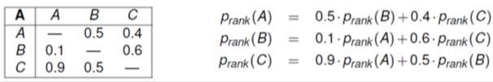
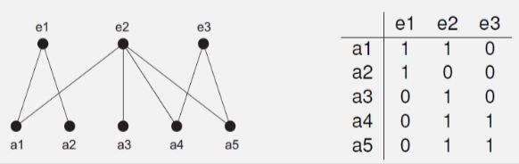

+++
title = 'Communities'
template = 'page-math.html'
+++
# Communities
Sociogram: graph-like representation of social structure
calculate stats like eccentricity, closeness, betweenness centrality

proximity prestige

- D is digraph with n vertices
- influence domain R-(v) of v is set of vertices from which v can be reached
- proximity prestige: (fraction of vertices that can reach v) / (average distance of those vertices to v)

ranked prestige

- A is adjacency matrix for digraph
- A[v,u] means how much v is appreciated by u

$\sum_{v \neq u} A[v, u] = 1$ for each vertex u

$p_{rank} (v) = \sum_{u \neq v} A[v, u] \times p_{rank} (u)$

$\sum_{v} p_{rank} (v)^2 = 1$

example:

structural balance

- a signed graph (edges labelled +/-) is balanced if all its cycles are positive (product of edge labels is positive)
- if the graph has no cycles, it is balanced
- signed graph is balanced iff its vertices can be partitioned into two disjoint subsets such that:
    - each negative edge joins the subsets, and
    - each positive edge joins vertices in the same subset

affiliation networks

- people are tied together through membership relations
- social structures consist of actors and events
- naturally bipartite, with two sets (Va actors, Ve events)
- represented with an actor-event matrix:

- number of events in which a and b participated

    $NE[a, b] = \sum_{e \in V_e} AE[a, e] \times AE[b, e]$

- number of actors participating in events e and f

    $NA [e, f] = \sum_{a \in V_a} AE[a, e] \times AE[a, f]$
