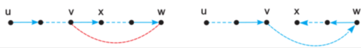

+++
title = 'Hamilton: vertices matter'
+++
# Hamilton: vertices matter
a Hamilton cycle contains every vertex exactly once

G is Hamiltonian if it has a Hamilton cycle (but it’s hard to prove that it is, no efficient algorithm)

to show that G is not Hamiltonian:

- if G is Hamiltonian, then for any nonempty V* ⊆ V(G)
    - the graph G-V* contains at most |V*| components
    - w(G-V*) ≤ |V*|
- if not true, graph not Hamiltonian

Dirac’s criterion

- if G has n ≥ 3 vertices and ∀v: δ(v) ≥ n/2
- then G is Hamiltonian

Finding Hamilton cycles using Posa rotational transformations

- Pick starting vertex u. Initial path P=[u]
- while P is not a Hamilton cycle:
    - If possible, select y from N(last added vertex) excluding vertices already in path
        - then add that y to the path
    - else, pick a v from N(last added vertex). Because v is already in path, there is an edge from *v* to some other vertex *x*.
        - do a switcherino — connect v to w, and reverse path from w to x:

Traveling salesman problem:

- finding a shortest Hamilton cycle in a complete, weighted graph
- because of Hamilton, there’s no efficient algorithm for this
- greedy algorithm: start with arbitrary cycle, swap edges if it reduces overall weight
