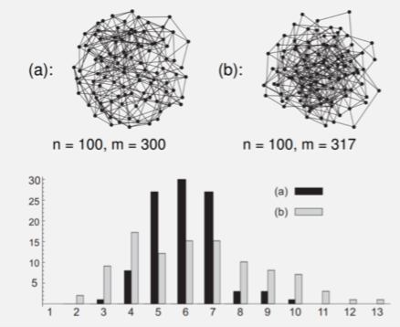
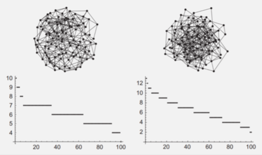

+++
title = 'Network analysis'
template = 'page-math.html'
+++
# Network analysis
Distribution of vertex degrees: vertices with high respectively low degree

<table>
<tr>
<th>Histogram</th>
<th>Ranked histogram</th>
</tr>
<tr>
<td></td>
<td></td>
</tr>
</table>

Distance stats:

- d(u,v) — shortest distance between u and v
- ε(u) — eccentricity. longest shortest path from u and to any other vertices
- rad(G) — radius. minimum eccentricity
- diam(G) — diameter. longest path in graph.
- d̄(u) — average length of shortest paths from u to any other v.
- d̄(G) — average path length (average of all d̄(u))
- characteristic path length —  median over all d̄(u)

clustering coefficient ([good video](https://www.youtube.com/watch?v=K2WF4pT5pFY))

- clustering — when many neighbours of vertex are also each other’s neighbours
- defined by:

    $cc(v) = \frac{2m_{v}}{\delta (v) \times (\delta (v) -1)}$

where mv is number of links between neighbours of v.

- for triangles:
    - triangle is complete subgraph of 3 vertices
    - triple is subgraph of 3 vertices and 2 edges
    - network transitivity τ(G) = nΔ(G) / ntriple(G)
        - nΔ(v)  — number of triangles of which v is a member
        - ntriple(v) — number of triples at v (*v* is incident to both edges)
        - essentially the same as clustering coefficient, but for whole graph

Centrality:

- center C(G) is set of vertices with min eccentricity
- vertex centrality of u cE(u) = 1 / ε(u)
- betweenness centrality of u cB(u) = sum |S(x,u,y)| / |S(x,y)| for x≠u≠y
    - S(x,y) — set of shortest paths between x and y
    - S(x,u,y) — shortest paths passing through u, S(x,u,y) ⊆ S(x,y)

Closeness:

- closeness of u cc(u) = 1 / (sum d(u,v) for all v in G)
