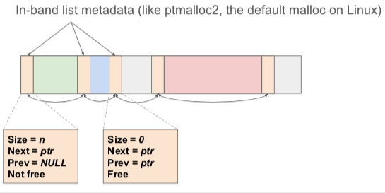

+++
title = 'A2 Allocator'
+++
# A2 Allocator

## Basic info
- malloc — allocate memory of given size
- free — deallocate memory
- realloc — extend/shrink previously allocated
- calloc — zero-initialised memory

first layer:
- allocator manages virtual memory region (heap)
- if free block is available in heap, block is returned

sometimes run out of space on heap, need more. need to tell OS that more virtual memory is needed — ask OS for more virtual memory using brk() (‘please extend the heap’). mmap() (‘create new virtual region in the address space’) is a generalised brk(). munmap() is undo for mmap().

every time you need memory, the mmu will try to translate and get page fault, which is done with page fault handler.

virtual memory regions are basically contract between OS and application on legal ranges of memory that we can access

demand paging:
1. Program calls brk() to grow its heap

2. brk() enlarges virtual memory address space. new pages are not mapped onto physical memory.

3. Program tries to access new memory, processor page faults.

4. Kernel assigns page frame to process, creates page table entry, and resumes execution. Program lives happily ever after in userland.

## Assignment
allocate user space allocator. gets memory from kernel, divides that, etc.

- `void *malloc(size_t size)` — allocate size bytes. alignment should be 8 bytes.
- `void free(void *ptr)` — free object starting at ptr
- `void *calloc(size_t nmemb, size_t size)` — allocate nmem * size bytes, zeroed out
- `void *realloc(void *ptr, size_t size)` — grow object starting at ptr to size bytes, optionally moving allocation if needed.

requesting memory from kernel
- nmap: allocate arbitrary virtual memory areas
- brk/sbrk: grow/shrink heap area
    - `int brk(void *addr)` — set program break (end of heap) to addr (if reasonable)
    - `void *sbrk(intptr_t increment)` — grow/shrink heap by increment bytes. returns old brk address.

getting started

```c
void *mymalloc(size_t size) {
    return sbrk(size);
}
```

problems:

- size unaligned. should be aligned to 8 bytes, so have to add some alignment. minimum of 8 bytes.
- free function is empty. it will run out of memory. how implement free function?
    - determine size of ptr. how big is the object?
    - mark area as free. then malloc can search free areas first.

design options
in-band list metadata


each node contains metadata (size, next, prev, is_free) and space for the object.

when freeing, merge with adjacent free areas.
avoid fragmentation — non-contiguous free areas.

list metadata example

```c
struct obj_metadata {
    size_t size;
    struct obj_metadata *next;
    struct obj_metadata *prev;
    int is_free;
};
```

don’t use artificial limit on max number of objects. should have pointer to heap_start, and pointer to freelist (both void). dynamically grow. would give penalty.

Grading
- 1 point — showing up (valid submission)
- 1 point — malloc
- 0.5 pnt — calloc
- 2 point — free + reuse
- 1 point — realloc (+only when needed)
- 1 point — batch brk: preallocate e.g. 4K of memory, only brk when 4K is full
- 2 point — reduce overhead per allocation (brk size vs malloc’d size)
- 0.5 pnt — locality (new allocations use least recently freed slots)
- 1 point — return memory to kernel (give negative to sbrk). return reasonable sized (e.g. 4K) chunk at end of heap if became free.
- 1 point — out-of-band metadata. e.g. slab allocator. this often excludes other points.
- 2 point — system malloc. implement malloc without prefix. use with LD_PRELOAD env var. tests run ls, grep, python.
