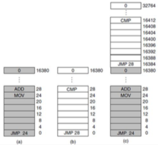

+++
title = 'Basics of memory: no abstraction'
+++
# Basics of memory: no abstraction
memory address space: addresses from first byte to last byte. in physical memory, it’s physical memory address space.

no memory abstraction: monoprogramming

options of arranging memory address space:

no memory abstraction: multiprogramming

- naive approach: move each program to a dedicated region:

    

    - problems:
        - relocation - you have to move to a completely different address.
            - load-time relocation option — as soon as program is loaded, patch all addresses with new ones
        - protection - both programs live together in memory. one program could overwrite the other
            - memory keys option — current memory protection key gets checked against memory protection key of address

