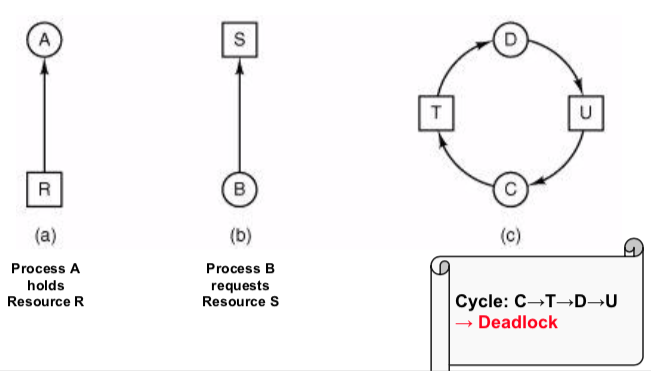
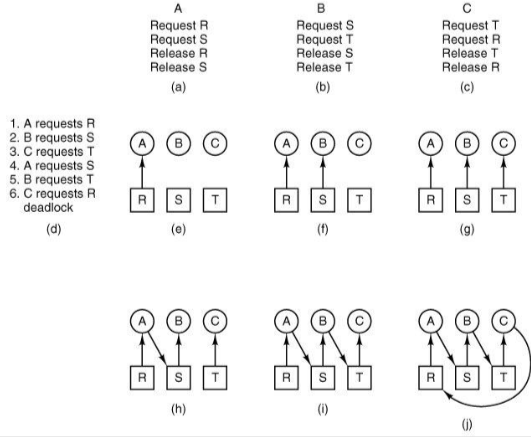
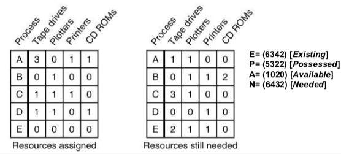

+++
title = 'Deadlocks'
+++
# Deadlocks

A set of processes is deadlocked if each process in the set is waiting for an event that only another process in the set can cause.

Starvation: nobody gets resources?
Livelock: many instructions executed but no progress

Conditions:

- Mutual exclusion: each resource is assigned to at most one process
- Hold & wait: processes can request resource when holding another one
- No preemption: resources are not preemptable, i.e. can’t be taken away from a process
- Circular wait: chain of at least two processes must be waiting for a resource held by next process in the chain

Handling:

- ignore the problem — no action taken
- deadlock detection — detect and perform recovery
- deadlock prevention — prevent any of deadlock conditions
- deadlock avoidance — allocate resources to avoid deadlocks

## Ignore the problem
become an ostrich and imagine the problem doesn’t exist.

assumes deadlocks are rare, the cost of handling them is high, and their effects are ok.

in practice, only last resort.

## Deadlock detection
can be used when simple & efficient detection mechanisms are available.

detection

- check for cycles in the resource allocation graph
- track progress, time out if necessary
- detect explicitly if e.g. OOM

recovery

- force preemption
- checkpoint-rollback
- kill the offending processes

in practice, solution of choice when adequate detection/recovery mechanisms are available

## Deadlock prevention
mutual exclusion:

- spool everything
- but this usually shifts problem somewhere else

hold & wait

- request all resources initially
- but this has poor parallelism and resource utilisation

no preemption:

- take resources away
- but not applicable in a lot of cases

circular wait:

- order resources numerically
- but it’s hard to consistently enforce in practice

in practice, adopted in particular domains (e.g. two-phase locking in transaction processing systems)

## Deadlock avoidance
single resource: Banker’s algorithm (Dijkstra)

- customers (processes) request credits (resources)
- banker (OS) only satisfies requests resulting in safe states
- a state is safe if there exists a sequence of other states that allows all customers to complete
- max credit demands are known in advance

multiple resources:

- generalised safe state detection:

- select row R whose unmet resource needs N are all <= A
- mark R as terminated and add its resources to A vector
- repeat until completion (safe) or deadlock (unsafe)

in practice, rarely an option (hard to determine resource needs in advance)
