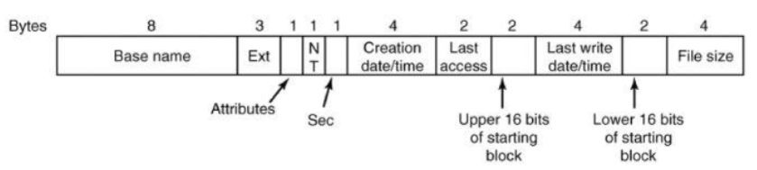

+++
title = 'File system layout'
+++
# File system layout
on real disk, there are number of partitions (primary, extended, subpartitions). each partition can hold different filesystem

one partition is flagged as 'active' partition.
MBR has boot code to locate active primary partition and execute boot block

partitions: primary, extended, and subpartitions

## How to store files on disk

contiguous allocation:

- files as contiguous stream of bytes
- but prone to fragmentation, requires max file size

block-based (logically contiguous, but actually stored anywhere on disk):

- linked list
    - by keeping in-band metadata, end up with strange block size (2 or 4 kb data, with some bytes to hold pointer)
    - good for sequential access patterns, but random...not so much
    - pointers are pointing to blocks on disk (NOT memory)
    - 
- file allocation table (FAT)
    - move in-band metadata out of band
    - the table is stored in kernel memory
    - holds starting points of files
    - every row refers to a block of memory
    - worked well for a while, but for modern sizes it is not possible to hold the table in memory
    - 
- I-nodes
    - just a FUCKTON of indirections
    - 

## How to implement directories

 

FAT layout:

- PBR stores "boot block"
- reserved is later used for filesystem info
- FAT #: preallocated file allocation table
- preallocated root dir (FAT12/FAT16)
- clusters are addressable blocks (FAT has chains indexed by starting cluster)
- 

UNIX dir entry:

- dir entry stores only name and inode number
- attributes are stored in inode
- one inode per file, first inode is root
- links:
    - hard link -- if 10 hard links to a file, then a single file with 10 dir entries pointing to that file (inode)
    - soft (symbolic) link -- if 10 soft links to a file, literally 10 files. can point to anything, but if file gets deleted, the link is dead.
- where are the inode stored? it depends, as always.

 

how to manage disk space

- linked list vs bitmap (linked list actually works really well here)

