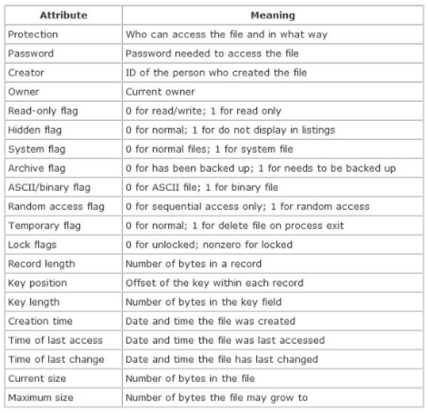
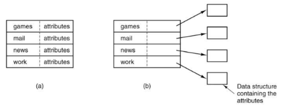
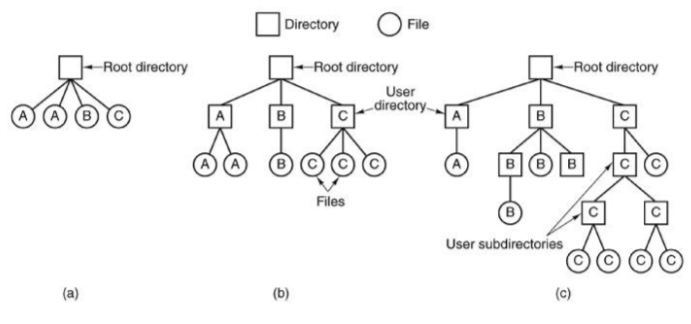

+++
title = 'Files'
+++
# Files
abstract storage 'devices' organised in (typically hierarchical) file system structure

file access:

- sequential (in order) vs. random access (e.g. second, then first, then third block)

file types:

- regular files, dirs, soft links
- special files (e.g. device files, metadata files)

file structure:

- OS' perspective: files as streams of bytes
- program's perspective: archives, executables, etc.
- is OS ever aware of the file structure?

file naming:

- different file systems have different limitations/conventions for filenames
- file extensions
- file name length:
    - FAT: 8.3 characters (8 name, 3 extension. later extended to 255)
    - EXT4: 255 characters
- Special chars in filenames:
    - FAT: no "\*/:<>?\| etc.
    - EXT4: no '\0' and '/' or special names '.' and '..'
- case sensitivity depends

file attributes:

- there's a whole bunch of them

file operations:

- create/delete
- open/close
- read/write
- append
- seek
- get attributes/set attributes
- rename

directories:

- persistent data structures organising and maintaining info about files
- file attrs stored in-band or out-of-band (both commonly used)

