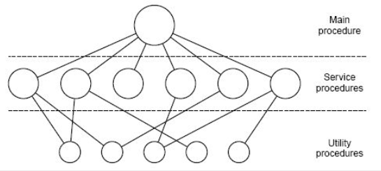
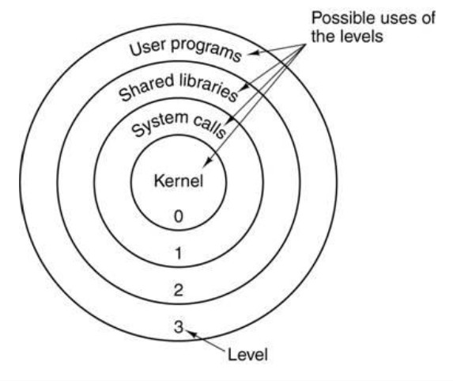
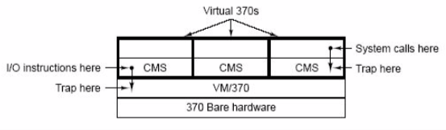
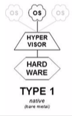
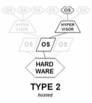
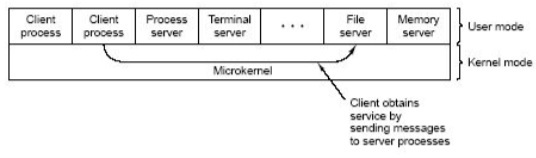
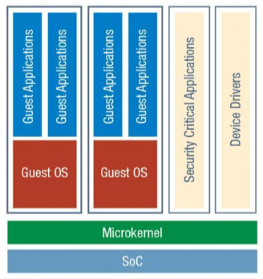

+++
title = 'Kernels'
+++
# Kernels
the type of kernel that you use, and the OS architecture, depends on the application

## Monolithic kernels

- main program invokes syscall
- kernel is underlying monolithic block:
    - service procedures carry out syscalls
    - utility procedures help implement service procedures

- separate applications and OS using privilege levels into user and kernel
    - on x86, 4 privilege levels (but in practice mostly 2 are used)
    - this is supported by the hardware directly
    - if only goal is to separate untrustworthy apps from lower level shit, you only need 2 separate levels
    - if you include more levels, there’s a cost associated with switching between levels, so why do it if it’s not needed

## Virtualisation

- originally to separate multiprogramming from extended machine
- N independent system call interfaces

- Virtual machine monitor (VMM/Hypervisor) emulates hardware
- types:
    - 1: VMM runs on bare metal (like Xen)

        

    - 2: VMM hosted on OS (like QEMU)

        

    - Hybrid: VMM inside OS (like KVM)

## Exokernel

- separate resource control from extended machine
- unlike VMM/Hypervisor, it:
    - does not emulate hardware. only resource manager
    - only provides *safe* low-level resource sharing
    - service procedures are offered as library linked directly to application -- "Library OS"
- different library OSes for different programs, allows application-level specialisation

## Client/server model (microkernel)

- organise service procedures in programs running in separate processes (system services/drivers)
- high level of isolation
- processes communicate via message passing
- calls rely on the same mechanism (message passing)
- messaging is implemented in microkernel (minimal kernel)
- principle of least privilege -- isolate every service in its own domain (address space, process, etc.)
- this is more secure, but lower performance (always a tradeoff). have to switch between modes and shit

## Microvisor

- combination of hypervisor and microkernel
- different OS architectures have different design points, people look at convergence and tradeoffs

## Unikernel

- "single simple application implementing whatever in the cloud, in most efficient way"
- squash application and OS kernel into one thing, don't need all of the other stuff like process management
- gets rid of all of the overhead
