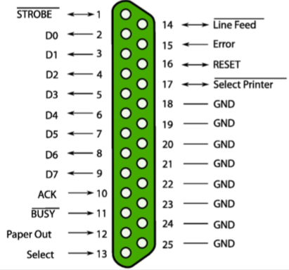

+++
title = 'Principles of IO hardware'
+++
# Principles of IO hardware
IO devices available to software via an interface

- character devices: all IO occurs as stream of bytes
- block devices: all IO occurs in units of randomly accessible blocks

device controller

- located between actual device and computer
- offers electronic interface via IO registers
- R/W those registers to ask controller to perform actions

example: parallel port

accessing IO registers

- port-mapped IO (PMIO):
    - IO registers are accessed via dedicated port numbers and special instructions
    - e.g. inb instruction
- memory-mapped IO (MMIO):
    - IO registers are mapped into address of main memory
    - can be accessed with a simple mov
- intel x86 is hybrid, does both PMIO and MMIO

IO ports have a specification from the manufacturer (e.g. IBM PC)

waiting for requests:

- we can send commands to devices, but what if requested operation takes time?
- polling:
    - most devices offer status bits in registers to signal that request has been finished (incl. error code)
    - OS can poll this status bit ("*polling*")
    - is this a good solution? not a general purpose solution, but good if we know it'll complete in a short amount of time.
- interrupts:
    - device controller can trigger interrupts to signal that IO requesst is complete
        - for device, means changing voltage on an electrical line
    - each controller has interrupt vector assigned
        - CPU runs vector-specific handler when interrupt occurs
    - process one interrupt at a time

data exchange between device and CPU

- how do we transfer data from hard disk to memory?
    - program disk controller to read sector
    - wait for interrupt
    - read a device register sizeof(sector) consecutive times
    - repeat for next sector
- problem? yes sir. CPU cycles can be spent in a better way
- so just let hardware do the copying -- Direct Memory Access!
    - on ISA systems, there was a dedicated DMA controller (third-party)
    - on PCI (and PCIe) systems each PCI device can become "Bus Master" and perform DMA (first-party DMA)
        - device and DMA controller are combined
        - you have to trust your hardware (or use an IO MMU)
    - embedded systems still have dedicated DMA controller
    - disk controller still uses own buffers
