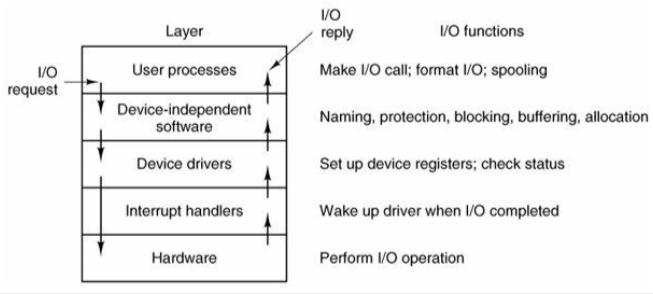

+++
title = 'Principles of IO software'
+++
# Principles of IO software
the concepts:

- device independence:
    - IO software provides abstraction over actual hardware
    - programs shouldn't have to care about device particularities
- uniform naming:
    - because if you have to type a unique 20 letter id to access a device you’ll give up
- error handling:
    - errors should be handled closest to their source so we don’t have to give a crap
- synchronous vs asynchronous IO:
    - programs don't want to deal with interrupts.
    - so OS turns async operations into blocking operations
    - then lower levels have to deal with interrupts
- buffering:
    - networking: incoming packets have to be buffered
    - audio: buffering to avoid clicks

the layers in practice:

interrupt handler

- device driver doesn't handle low-level interrupt directly
- lowe-level handler is relatively generic
- on linux, calls device driver-specific interrupt handler if registered
- on minix, sends message to device driver that registered for interrupt

device driver:

- accepts abstract reqs from device-independent layer and transforms them into commands for the device
- can queue new requests as necessary
- usually needs to wait for completion of the request (IRQ)
- checks for errors and answers requests from device-independent layer

device independent IO software:

- uniform interfacing for device drivers (driver nterface, naming (major/minor numbers), and protection
- buffering: necessary for both character and block devices
- error reporting: hardware-level, driver-level, etc.
- allocing/deallocing dedicated devices (e.g. printers)
- device-independent block size: unify blocks/characters across devices

user-level IO software

- single interface allowing user to access devices
- in C: fopen, close, fflush, frpintf, and so on
- safely multiplexes access to exclusive devices
