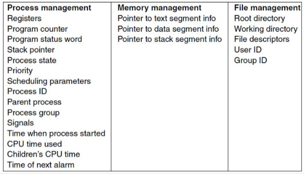
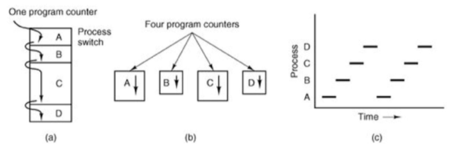
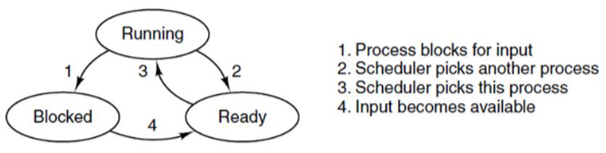
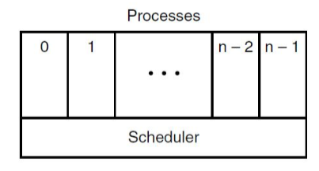

+++
title = 'Process model'
+++
# Process model
**process:** program in execution (amount of processes depends on the program)

it’s an abstraction that allows OS to simplify resource allocation, accounting, and limiting.

## Process table
OS maintains info on resources and internal state of every process

information in Process Table: ID (PID), User (UID), Group (GID), memory address space, hw registers, open files, signals, etc.

process control blocks:

## Concurrent processes

in principle, multiple processes are mutually independent (they have nothing at all in common). need explicit means to interact with each other.

the CPU gets allocated to each process in turn

- on OS level: save context of process A (program counter, registers, etc.), switch to B. to go back to process A, simply restore context.

OS (normally) offers *no timing or ordering guarantees*

## Process hierarchies
OS creates only 1 init process (usually)
parent process can create a child process
results in a tree-like structure and process groups

## Process management
fork: create new process

- child is 'private' clone of parent
- shares *some* resources with parent

exec: execute new process image

- used in combination with fork
- replaces the current command

exit: cause voluntary process termination

- exist status returned to parent process

kill: send signal to process (or group)

- can cause involuntary process termination

## Process states
OS allocates resources to processes
three process states:

- running: process is currently executed by CPU
- blocked: process is waiting for available resources
- ready: process is ready to be selected

scheduler allocates/deallocates the CPU. there is no immediate transition between states because process has to wait for scheduler

## Scheduler vs processes

- scheduler periodically switches processes
- sequential processes lie on the layer above
- leads to simple process organisation

