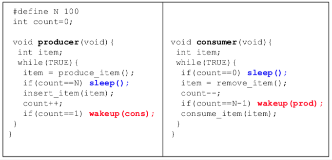
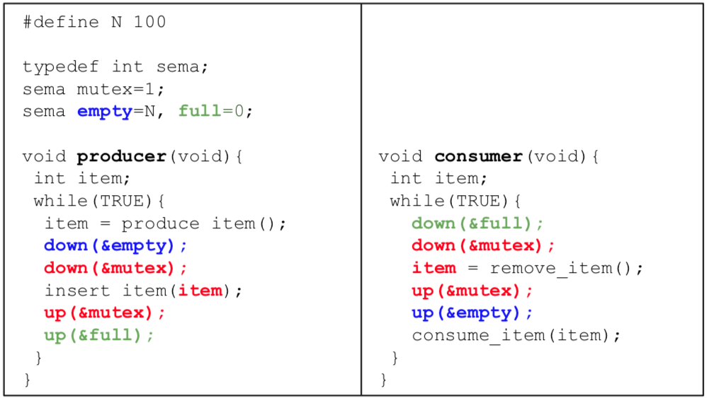
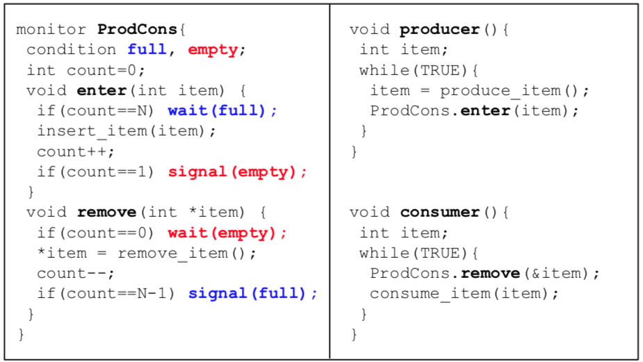

+++
title = 'Race conditions & mutual exclusion'
+++
# Race conditions & mutual exclusion
programs can race each other and come to wrong conclusions.

## Mutual exclusion
critical region: a code region with access to shared resources

the conditions for mutual exclusion:
1. no two processes can be simultaneously in their critical regions
2. no assumptions can be made about speed/number of CPUs
3. no process running outside critical region may block others
4. no process should have to wait forever to enter critical region

non-solutions

- disable interrupts (disable reallocation of CPU). if you have multiple processors, shit gets fucked.
- lock variables (guard critical regions with booleans). so now the race is on the lock variables, great job dude.
- strict alternation (be nice and take turns). doesn’t allow processes to enter critical regions twice in a row, and a process outside the critical region can block another one.

Peterson's algorithm

- software solution
- spin lock in the while loop

```c
#define N 2
int turn;
int interested[N];

void enter_region(int process){
    int other = 1 - process;
    interested[process] = TRUE;
    turn = process;
    while(turn==process && interested[other]==TRUE);
}

void leave_region(int process) {
    interested[process] = FALSE;
}
```

TSL instruction

- hardware-assisted solution to mutual exclusion problem
- atomic test and set of a memory value
- spin until LOCK is acquired

```
enter_region:
TSL REGISTER, LOCK    | copy LOCK to register, set LOCK to 1
CMP REGISTER, #0      | was LOCK zero?
JNE ENTER_REGION      | if it was non-zero LOCK was set, so loop
RET                   | return to caller; critical region entered

leave_region:
MOVE LOCK, #0         | store a 0 in LOCK
RET                   | return to caller
```

## Avoiding busy waiting
so far, CPU busy waits until it can enter the critical region (spin lock).
so, let process waiting return CPU to scheduler voluntarily.

```c
void sleep() {
    set own state to BLOCKED;
    give CPU to scheduler;
}

void wakeup(process) {
    set state of process to READY;
    give CPU to scheduler;
}
```

Producer-consumer

- producer sleeps when buff is full
- consumer sleeps when buff is empty



- problem: wake up process may get lost. only wake up producer when count is N-1, but producer sleeps when count is N.

Semaphores

- introduce sema integer type with operations:
    - down: if sema ≤ 0, block calling process. sema-- otherwise.
    - up: if there is process blocking on sema, wake it up. sema++ otherwise.
- OS guarantees that all the operations are atomic (happening instantaneously) by design — disable interrupts on single processors, spin locking on multiprocessors.
- mutex (mutual exclusion) variable serialises access to shared buffer



Monitors

- semaphores introduce chaos in programs (gotta set all them bits)
- monitors: serialise procedure calls on a module, use condition vars to wait/signal processes
- but this needs dedicated language support



## Message passing: solution to process sync and communication

- processes interact by sending & receiving messages.
- most common in multiserver OS designs
- issues — mem copying vs register passing (efficiency), mailboxes vs rendezvous
