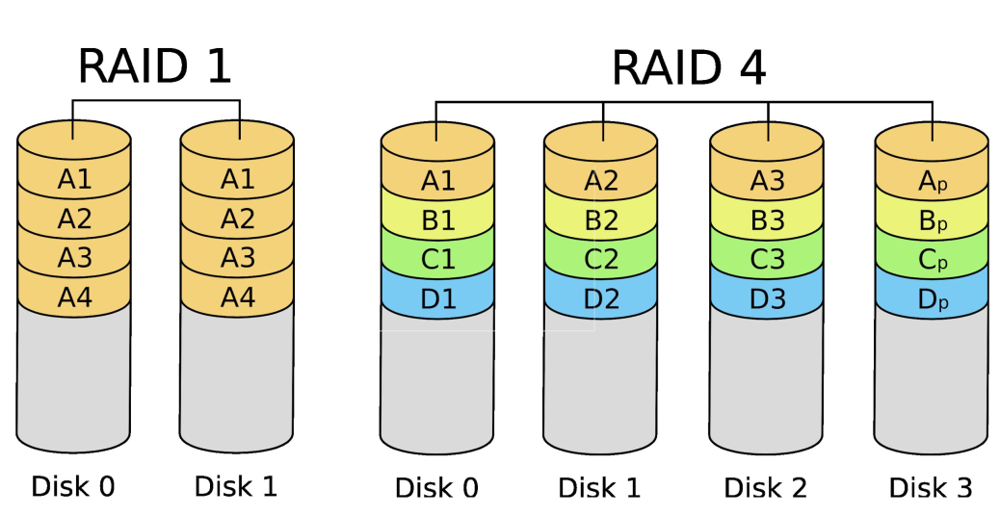
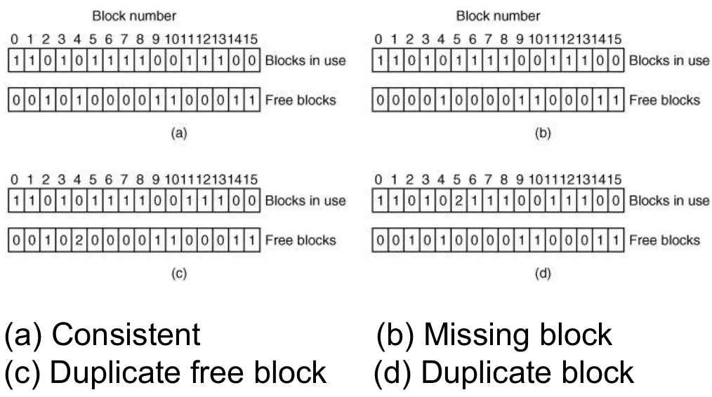
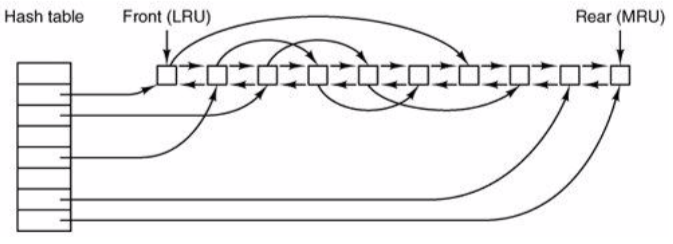
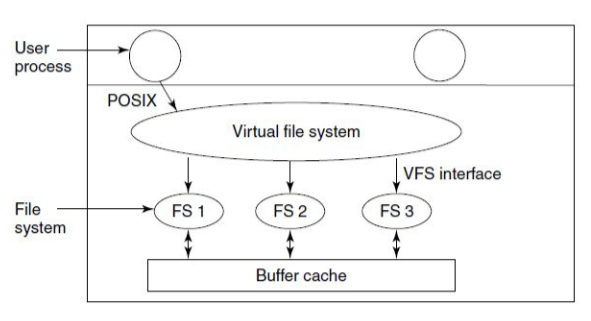
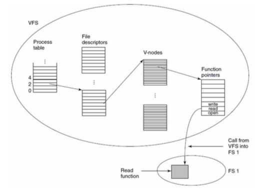

+++
title = 'Reliability & Performance'
+++
# Reliability & Performance
## How to ensure reliability
what are the threats?

- disk failures: bad blocks, whole-disk errors
- power failures: (meta)data inconsistently written to disk
- software bugs: bad (meta)data written to disk
- user errors: `rm *.o` vs `rm * .o`; `dd if=/dev/zero of=zeros bs=1M # fill disk quota`

backups: incremental vs full, online vs offline, physical vs logical (on filesystem level), compressed vs uncompressed, local vs remote

RAID: redundant array of independent (originally inexpensive) disks

- virtualise addressing on top of multiple disks (as single address space)
- RAID control operates just like MMU in memory
- options:
    - mirroring (RAID 1) -- no real slowdown or advantage for writing. but reading can be done in parallel from two different disks.
    - striping (RAID 0) -- scatter accross disks. no reliability benefits, but very good performance.
    - hybrid -- first few you stripe. the last disk, you store parity bits.
- 
- [Wikipedia page](https://en.wikipedia.org/wiki/Nested_RAID_levels)

fsck (File System Consistency Check)

- you need invariants. so exploit redundancy in existing filesystems.
- 

## Improve filesystem performance:
minimize disk access:

- caching: buffer cache, inode cache (literally cache of inodes stored in memory), direntry cache (for e.g. path name lookups)
    - buffer cache:
        - build list recently used queue. end is most recently used, front is least recently used.
        - periodically evict from front. hash table pointing to indicies (don't have to go through whole list to search)
        - write-through caching (if doing write on block, will do on cache, and immediately persist on disk) vs. periodic syncing (periodically write back blocks in buffer cache, typically with daemon)
        - 
- block read ahead (anticipate access patterns

minimize seek time (stay in the same section of memory more or less):

- try to alloc files contiguously
- spread i-nodes over disk
- store small file data 'inline' in i-node (as metadata kind of)
- defragment disk

## Different file system options:
log-structured filesystems:

- optimise for frequent small writes
- collect pending writes in log segment, flush to disk sequentially
- segment can contain anything (inodes, dir entries, blocks, whatever) and can be e.g. 1 MB in size
- relies on inode index to find inodes in log efficiently
- garbage collection to reclaim stale log entries

journaling filesystems:

- use 'logs' for crash recovery
- first write transactional operations in log:
    - remove file from its dir
    - release inode to pool of free inodes
    - return all disk blocks to pool of free disk blocks
- after crash, replay operations from log
- requires single operations to be *idempotent*
- should support multiple, arbitrary crashes
- journaling is widely used in modern filesystems

virtual filesystems (VFS):

- 
- 
