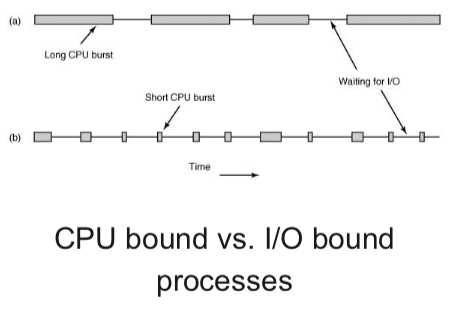
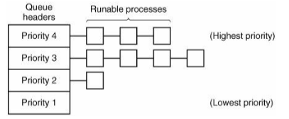
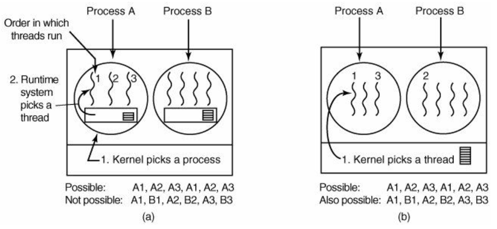

+++
title = 'Scheduling'
+++
# Scheduling

if more processes ready than CPUs available:

- scheduler decides which process to run next
- algorithm used by scheduler is called scheduling algorithm

when to schedule?

- process exits
- process blocks on IO or semaphore
- when new process is created
- when IO interrupt occurs
- when clock interrupt occurs

scheduling #goals

- different goals for batch, interactive, or real time systems
- for all systems:
    - fairness: giving each process a fair share of CPU
    - policy reinforcement: carrying out stated policy
    - balance: keeping all parts of system busy
    - throughput: maximise jobs per hour
    - turaround time: minimise time between submission and termination
    - CPU utilisation: keepin CPU busy *all the time*

Batch scheduling algorithms:

- First-Come First-Served (FIFO)
    - process jobs in order of arrival
    - non-preemptive
    - single process Q:
        - new jobs or blocking processes are added to end of Q
    - can lead to "convoy effect" if only few CPU bound and many IO bound processes
- Shortest job first:
    - pick job with the shortest run time
    - provably optimal: lowest turnaround time
    - of course, runtimes have to be known in advance
    - may lead to starvation, if a lot of short-lived processes arrive then a long run-time process will never run
    - highest-response-ratio-next -- improved version of shortestjob first

Interactive scheduling:

- response time -- respond to requests quickly
- proportionality -- meet users' expectations
- algorithms:
    - round robin scheduling:
        - preemptive algorithm
        - each process gets a time slice (quantum)
        - if process is still running at end of quantum, it gets preemted & goes to end of ready Q
        - how big should that quantum be? depends on the implementation (lol when does it not depend)
            - of course, you don't want most of the time to be context switching
    - priority scheduling
        - similar to round robin, but several ready Qs
        - 
        - next process is picked from Q with highest priority
        - static vs dynamic
            - static priority: there is a single unchanging priority. often used as base priority level.
            - dynamic priority: OS cleverly decides which processes should have higher priorities (e.g. if IO bound, should have higher priority than CPU bound)
        - but can lead to priority inversion (e.g. Pathfinder). solutions:
            - priority ceiling protocol: mutex gets priority assigned of the highest priority process that might lock the mutext
            - priority inheritance protocol: high priority process blocks because low priority process hold mutex -> low priority process 'inherits' priority of blocked process
            - random boosting: ready processes holding mutexes are temporarily (and randomly) boosted in priorities
        - how to minimise response time for each priority Q? shortest process next:
            - use shortest job first and try to best predict next running time
            - form weighted average of previous running times of processes
    - guaranteed scheduling
        - N processes running -> each process gets 1/Nth of CPU time (aka fair-share)
        - calc how much CPU time process might have gotten (time since process creation divided by N)
        - measure actual consumed CPU time
        - form ratio (e.g. 0.5 means process running for half the time it was entitled to)
        - pick process with smallest ratio to run next
    - lottery scheduling
        - processes get lottery tickets
        - whenever scheduling decision has to be made, OS chooses winning ticket randomly
        - processes can have multiple tickets & priorities
        - tickets can be traded between processes

real time systems

- main concerns:
    - meeting deadlines - avoid using data
    - predictability - avoid quality degradation in multimedia systems
- soft real time vs hard real time (cannot miss any deadlines)
- can consist of periodic and aperiodic tasks
- schedules can be static (schedules are known in advance) or dynamic (make scheduling decisions during execution)
- system with periodic tasks is schedulable when we can meet the deadlines

