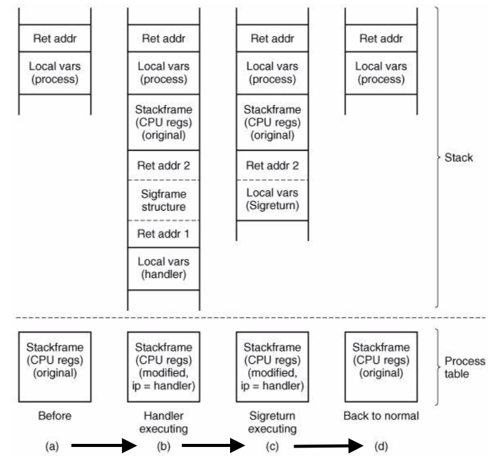

+++
title = 'Signal handling'
+++
# Signal handling
types:

- hardware-induced (e.g SIGILL)
- software-induced (e.g SIGQUIT, SIGPIPE)

actions (responses):

- Term (terminate), Ign (ignore), Core (terminate execution & OS core dump), Stop (stop execution, freeze process), Cont (continue, unfreeze processs)
- Default action on per-signal basis, which is typically overridable (but some aren't, like SIGKILL)
- signals can typically be blocked and actions delayed (but again, some exceptions)

catching signals:

- process registers signal handler
- OS delivers signal, allows process to run handler
- current execution context has to be saved/restored

diagram example:

