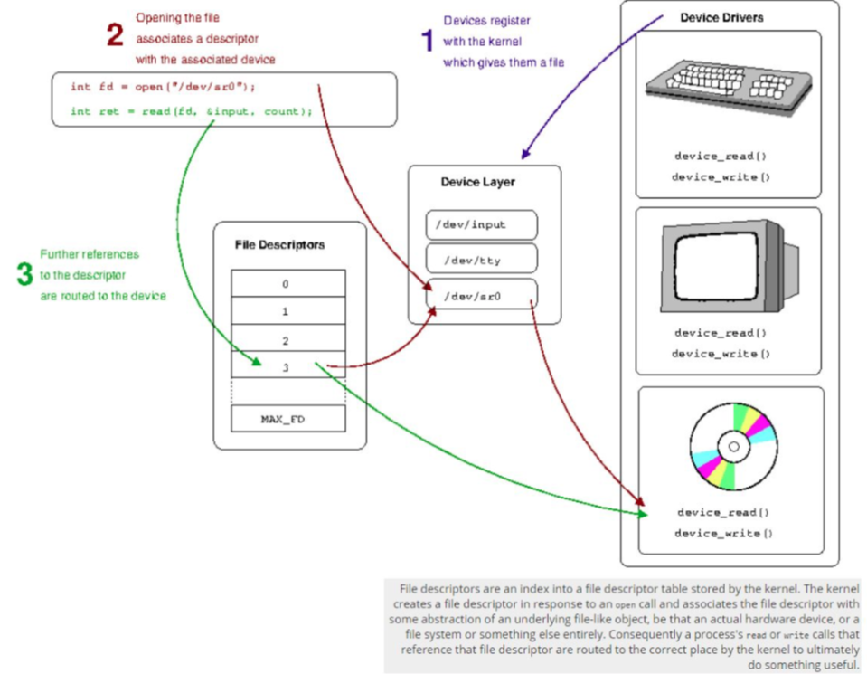
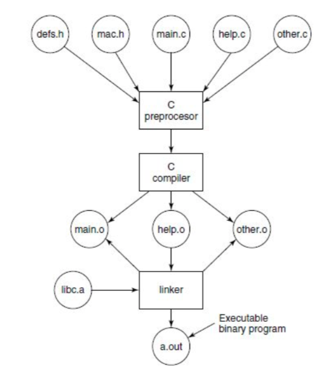
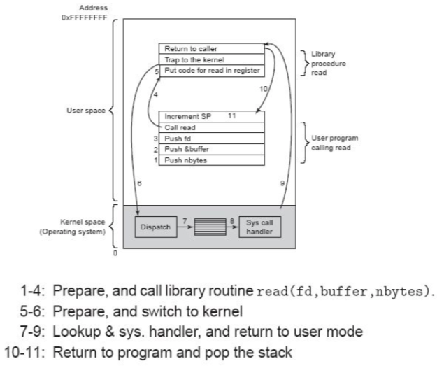
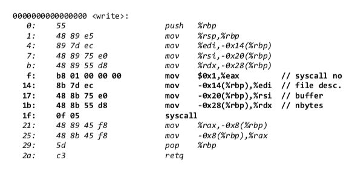

+++
title = 'System calls'
+++
# System calls

- every process starts with 3 files open: stdin, stdout, stderr
- steps:



- what has to happen to print hello world to stdout?
    - build process:

        

    - iteration 1

        ```c
        #include <stdio.h>
            int main(int argc, char **argv) {
            printf("Hello World!\n");
                return 0;
            }
        ```

    - iteration 2

        ```c
        #include <unistd.h>
        #define STDOUT 1
        int main(int argc, char **argv) {
            char msg[] = "Hello World!\n";
            write(STDOUT, msg, sizeof(msg));
            return 0;
        }
        ```

    - iteration 3
        ```c
        #define _GNU_SOURCE
        #include <sys/syscall.h>
        #define STDOUT 1
        int main(int argc, char **argv) {
            char msg[] = "Hello World!\n”;
            int nr = SYS_write;
            syscall(nr, STDOUT, msg, sizeof(msg));
            return 0;
        }
        ```
- syscall diagram

    

- syscall (x86 Linux) is triggered by instruction (like 0x80):
    - privilege level changed to kernel mode
    - program counter set to specific location
    - arguments passed in registers:
        - rax <- syscall number
        - ebx, ecdx, edx, esi, edi, ebp <- arguments
        - stack <- more arguments
    - x86-64 supports legacy int 0x80, new instruction syscall
        - rax <- syscall number (different from 32bit)
        - rdi, rsi, rdx, r10, r8, r9 <- arguments
- hello world without glibc -- manual system calls, in-line assembly:

    ```c
    ssize_t write(int fd, const void *buf, size_t nbytes) {
            ssize_t ret;
            asm volatile
                (
                    /* request syscall to OS (can also be ‘int $0x80’) */
                    “syscall”

                    /* return result in %eax */
                    : "=a" (ret)

                    /* __NR_write (1) into same place as operand 0, fd into %rdi, buffer into %rsi, length into %rdx */

                    : "0" (__NR_write), "D"(fd), "S"(buf), "d"(nbytes)

                    /*  modified cc, registers %rcx and %r11, and memory */
                    : "cc", "rcx", "r11", "memory"
                );
            return ret;
        }
    ```
    - actual objdump of this program

        
