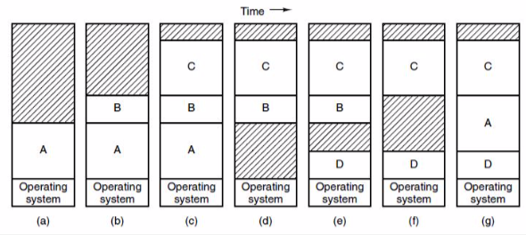

+++
title = 'The Memory Address Space'
+++
# The Memory Address Space
introduce abstraction of address space - every program runs in its own address space

- base register operates dynamic relocation, controls where address space starts
- limit register decides maximum address in physical memory that you can access

how memory works with many programs:

- processes compete for memory partitions
- but how do you know the size of partitions? use dynamic partitions and swapping

    

    - problem: swapping may lead to memory fragmentation (when you have a many separate small chunks of free memory)
        - solution: memory compaction
    - problem - need to allow extra room for process growth
        - how much extra room? memory usage vs out-of-memory (OOM) risk
        - what do when OOM (out of mana/memory)?
            - kill process
            - relocate process
            - swap out

memory management

- which part of memory is allocated?
    - divide memory in blocks (e.g. each block is 4 bytes)
    - keep track of them using:
        - bitmap
            - divide memory in blocks. every bit in bitmap corresponds to a byte in memory. bit is 1 when the memory is allocated, 0 when it's free.
            - in bitmap, allocation is super fast. but to find free memory, you need to slowly scan for a hole.
        - linked list of unallocated memory
            - allocation is slow af, so is deallocation
            - holes sorted by address for fast coalescing
- how do you allocate?
    - first fit: take first fitting hole (MINIX 3). simplest option.
    - next fit: take next fitting hole. slower than first fit in practice.
    - best fit: take best fitting hole. prone to fragmentation.
    - worst fit: take worst fitting hole. poor performance in practice.
    - quick fit: keep holes of different sizes. poor coalescing performance.
    - buddy allocation scheme: improve quick fit's coalescing performance (Linux uses this).
        - originally - area of 64 "chunks" (a unit chunk is whatever you want, on UNIX it's 4 kb)
        - maintain *n* lists, one per size class
        - you split on powers of 2 until you get the right size
        - how do you find your buddies? shout eyyyyy buddy
