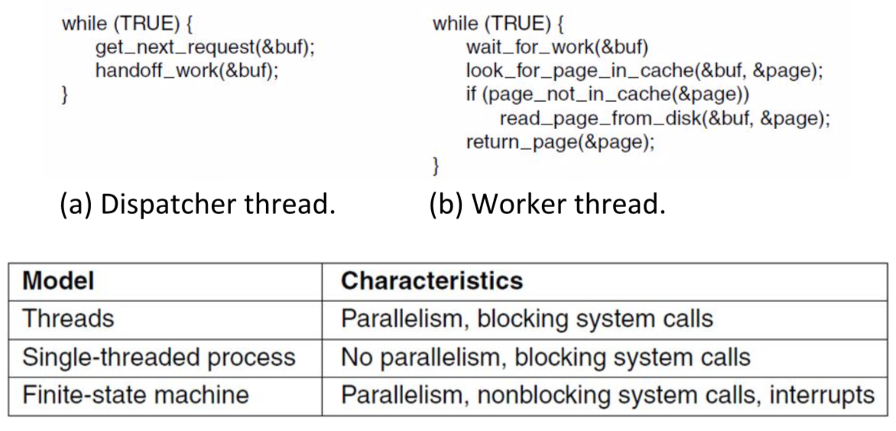
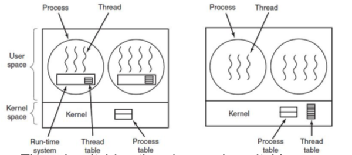
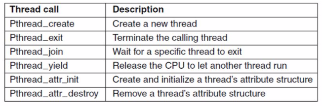

+++
title = 'Threads'
+++
# Threads
## Multithreaded execution: 1 process, N threads of execution

- lightweight processes, allow space and time efficient parallelism
- organised in thread groups, allow simple communication and synchronisation

- threads are in the same address space of a single process
- all info exchange done via data shared between threads
- threads synchronise via simple primitives
- each thread has its own stack, hardware registers, and state
- each thread may call any OS-supported syscall on behalf of the process to which it belongs

## User threads - pros and cons

- (+) thread switching time is quicker, as no mode switch
- (+) scalability customizability (since no in-kernel management)
- (-) parallelism (blocking syscalls are problematic)
- (-) transparency (typically needs app cooperation)

**
**
## Hybrid implementations of threads:

- thread multiplexing: one kernel thread runs everything
    - virtualises N user threads over 1 kernel thread
    - mitigates transparency and parallelization issues
- scheduler activation: scheduler takes care of blocking/unblocking
    - upcalls notify userland of blocking/unblocking events
    - userland schedules thread accordingly
- pop-up threads: kernel takes care of creating threads
    - kernel spawns new thread in response to event
    - thread may run at kernel or user level

## POSIX threads (Pthreads)
pthread is a library interface. names may not always be the same.

## Inter-process communication (IPC)

- Processes need some way to communicate - to share data during execution
- No explicit cross-process sharing, data must be normally exchanged between processes
- Processes need a way to synchronise
    - to account for dependencies
    - to avoid them interfering with each other
