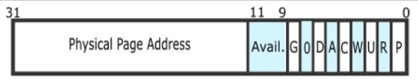
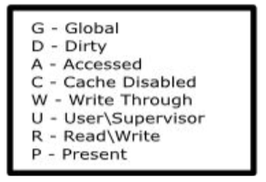
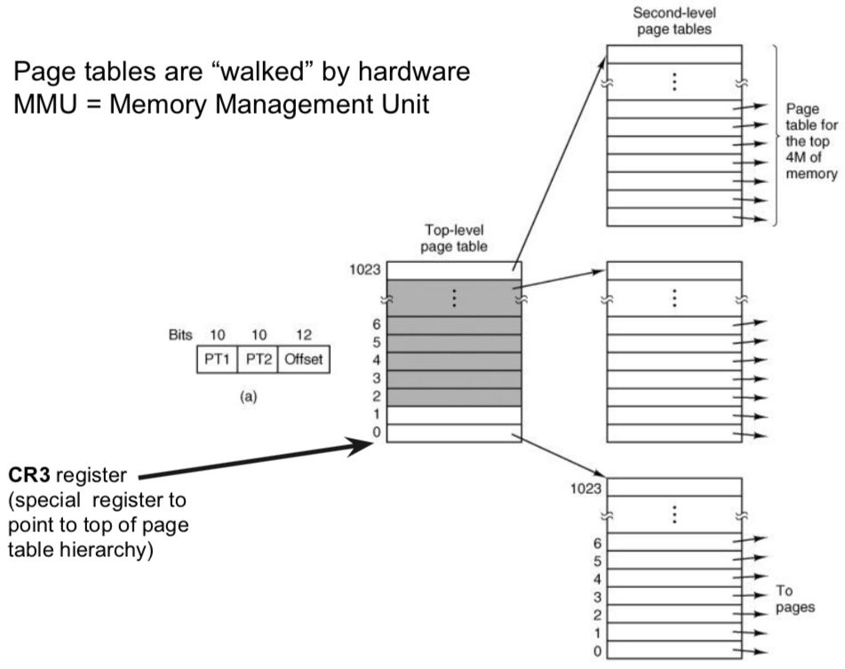
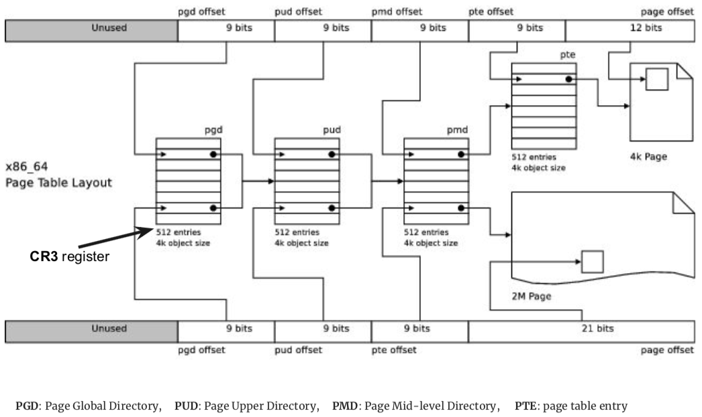
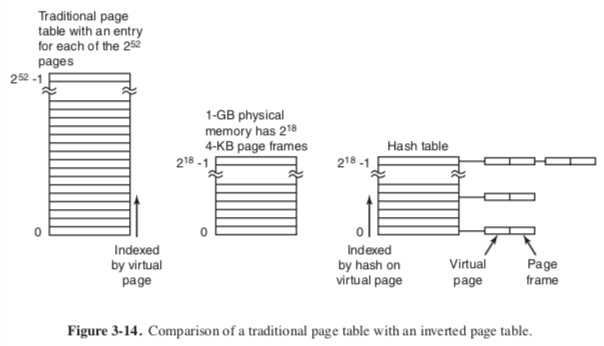
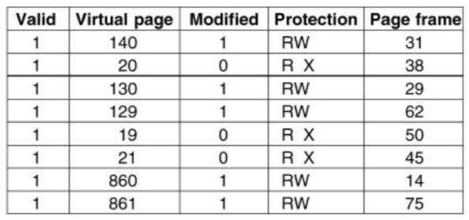

+++
title = 'Virtual memory'
+++
# Virtual memory
problem: so far memory can only be given to processes in contiguous pieces
solution: another level of abstraction!

- divide physical memory and program (virtual) memory into pages of fixed size (typically 4 KB)
- give program a number of virtual pages
- translate virtual pages into physical pages (frames)

MMU (memory management unit) translation between virtual memory address and the physical memory address

- size of memory address space depends on architecture
- OS decides how to map page tables
- no need to translate offset
- create illusion that every process has unlimited memory
- page tables contain pages
    - x86 page table entry
        - 4kb page size
        - 32-bit physical and virtual address space
        - 32-bit page table entries (PTEs)
        - 
        - 

but this leads to a lot of wasted memory, we are keeping around page table entries that aren’t used or don’t have many meaningful values

so we use sparse data structures, break up the page tables (and you can legit go crazy with this)

two-level page tables (x86)

- CR3 register points to top of page table hierarchy
- page tables are 'walked' by hardware MMU
- first 10 bits of page frame address -- field in page directory (top-level page table). this gives the resultant page
- second 10 bits of page frame address -- field in secondary table

four-level page tables (x86-64)

inverted page tables (IA-64)

with page tables, MMU has to translate every single memory access, leads to lower performance.

try caching previous translations in a TLB and praying to God for locality.

## Translation Lookaside Buffer (TLB):

- contains translation info for one single memory address space (process)
- 1 TLB per CPU, sometimes with multiple levels

- flush TLB when entries change, context switch (unless you tag with PID)
- when to expect many TLB misses? after flushes, and when processes have a lack of locality
- software vs hardware-managed TLB
    - hardware - efficiency: hardware walks page tables and fills TLB
    - OS - flexibility: e.g. OS may preload TLB entries that it expects to need later
- TLB miss handling:
    - walk page tables to find mapping
    - if mapping found, fill new TLB entry (soft miss)
    - if mapping not found, page fault (hard miss)
    - OS handles page faults (similar to interrupts):
        - if access violation: segfault
        - if legal access, page fault handler needs to fix up page tables:
            - page is already in memory (minor page fault)
            - page must be fetched from disk (major page fault)
- page replacement
    - computer might use more virtual memory than it has physical memory
    - paging creates illusion of unlimited memory available to user processes
    - when logical page is not in memory (swapped out to file/partition), the OS has to page it in on a page fault
    - but because memory is not actually unlimited, the new page has to replace an old page
    - how should we swap out?
        - optimal:
            - replace page that will be referenced as far in the future as possible
            - can this algorithm be implemented in practice? maybe? with a deterministic workload, you can profile it.
        - random:
            - just replace a page at random
        - not recently used (NRU):
            - periodically clear R/M bit for all pages
            - replace page at random, but prioritize those with R=0, M=0
        - FIFO:
            - build queue of faulting pages and replace the head
            - unfortunately, oldest page might still be useful
