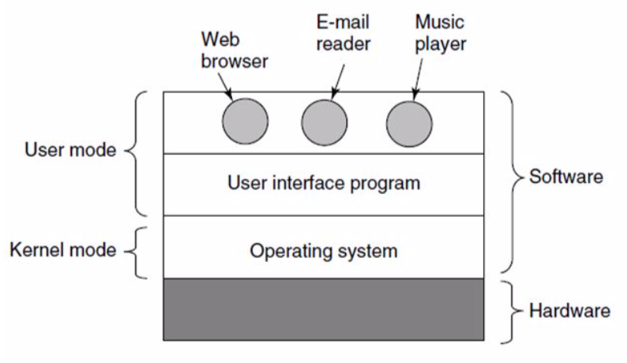
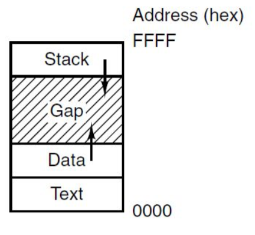
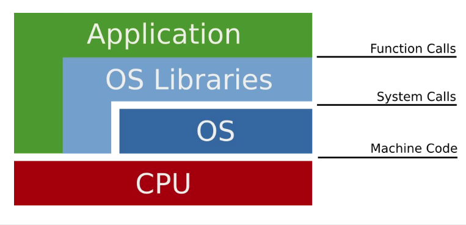

+++
title = 'What is an OS?'
+++
# What is an OS?
## Some history
Batch systems: one job at a time

Multiprogrammed systems: store multiple jobs in memory, with an operating system that schedules, allocates, multiplexes. but one job after another, with a lot of waiting.

Time sharing: single CPU can be passed between jobs, multitasking, illusion of parallelism.

You are not expected to understand this.

## What is an OS?
Kernel vs user mode:

OS is an extended machine — it extends & abstracts over hardware functionality
OS is resource manager — protects unsafe use of resources, accounting/limiting

- offers functionality through syscalls
- groups of syscalls offer services
- processes are abstractions to create user’s program
- each program/process has its own address space
- data is in files, these persist over processes

## Processes

- process represents instance of a program in execution, with a name
- memory address spaces limit programs to a specific part of memory. layout depends.

## Memory address space

very basic layout is stack (frames for function calls), data (variables), text (program code)

## Structure of the OS

## System calls

- interface offered by OS to apps for service requests
- interface depends on OS and hardware, so encapsulate syscall logic in libc (POSIX standard)
