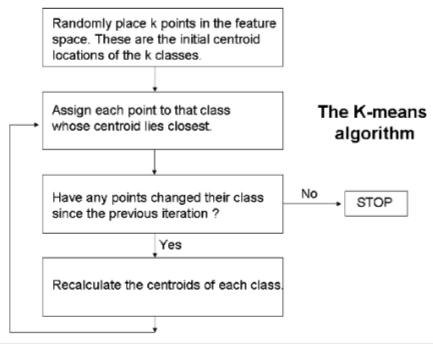
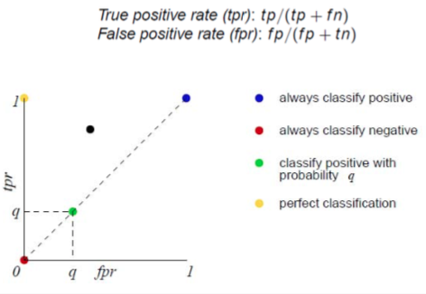
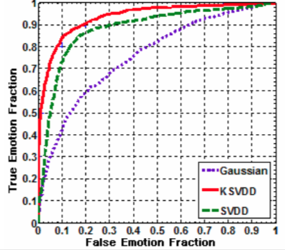

+++
title = 'Classification 2'
template = 'page-math.html'
+++
# Classification 2
uncertainty is everywhere. probabilistic models look at learning as process of reducing uncertainty.

probability can be for single variables, but also conditional/posterior — how existing beliefs change in light of new evidence

## Naive Bayes classifier

given a set of classes, use Bayes rule to get posterior probabilities that object with features belongs to class.

the class with highest posterior probability is most likely class.
naive — assuming that elements in feature vector are conditionally independent

$P(C_{i} | X) = \frac{P(X | C_{i}) \times P(C_{i})}{P(X)}$

## Hidden Markov Model Classifier
works on a set of temporal data (when time is important)
each clock tick, the system moves to new state (can be the previous one)
we do not know these states (hidden), but we see observations
steps:

- Train by calculating:
    - probability that person is in state x
    - transition probability P(xj | xi)
    - observation probability P(yi | xi)
- Use HMM as classifier
    - given observation y, use Bayes to calculate P(xi | y)
    - class with highest P wins

## Unsupervised learning

do not have training sets, explore data and search for naturally occurring patterns and clusters

once clusters are found we make decisions

two inputs cluster if their vectors are similar (they are close to each other in feature space)

## Evaluating classifiers

predictive accuracy — proportion of new, unseen instances that classifies correctly

classification error — correctly classified or not
error rate — # of classification errors / # of classifications attempted

true positives/negatives VS false positives/negatives — false negatives can be most dangerous!

true positive rate (hit rate) — proportion of positive instances that are correctly classified as positive (TP/(TP+FN))

false positive rate — negative instances that are erroneously classified as positive (FP/(FP+TN))

accuracy — percent of correct classifications

confusion matrix gives info on how frequently instances were correctly/incorrectly classified. the diagonal is what’s important.

when writing a report, it’s best to explicitly give the confusion matrix

receiver operating characteristics (ROC) graphs
useful for organising classifiers and visualising their performance
depict tradeoff between hit rates and false alarm rates over noisy channel

