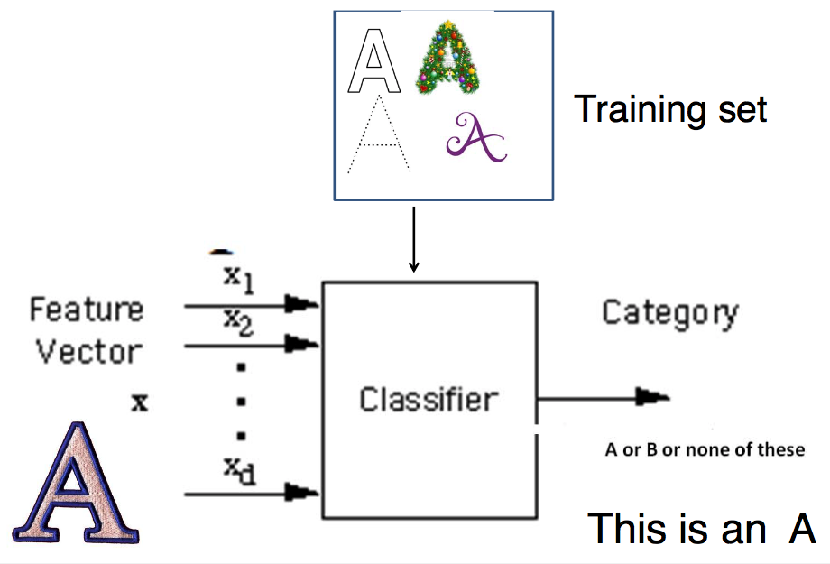
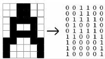

+++
title = 'Classification'
+++
# Classification
a pattern is an entity vaguely defined, that could be given a name.
recognition is identification of pattern as member of a category

## Types of pattern recognition (classification) systems

- speech recognition:

    1. PC card converts analog waves from mic into digital format
    2. acoustical model breaks the word into phonemes
    3. language model compares phonemes to words in built-in dictionary
    4. software decides on what spoken word was and displays best match

- brain-computer interface that acquires signals directly from the brain
- gesture recognition using acceleration magnitude from watch
- image recognition

## Classification (known categories)

- given a few classes, each item belongs to one class
- objects are described by features
- system needs a training set (both positive and negative examples)
- if a new item comes, its features are measured and the system decides which class it belongs to

Components:

- Sensing module
- Preprocessing mechanism
- Feature extraction mechanism
- Classifier
- Training set of already classified examples

### Building a pattern recognition system

1. Choose features, define classes (e.g. coins 10 cent, 20 cent, 50 cent, 1$, 2$)

    - features need to have discriminative power
    - not too many, but enough to reliably separate classes based on them
    - e.g. coins colour and diameter
    - algorithms
        - simple: rule-based activity recognition (If…And/Or…Then)
        - complicated: machine learning decision trees, HMM, neural networks

2. Extract features

    - image recognition
        - shape decriptors
            - form factor (round object has 1, others smaller)
            - Euler number (number of objects minus number of holes in objects)
            - perimeter, area, roundness ratio…
        - preprocessing
            - binarisation, morphological operators, segmentation
        - extract features (e.g. area, coordinates of centre of mass)
        - optical character recognition (OCR)
            - converts image into machine readable text
            - uses statistical moments (total mass, centroid, elliptical parameters, etc.)
            - invariant moments of Hu
    - sound recognition
        - features
            - frequency spectrum
            - spectrograms
            - Mel cepstrum coefficients — FFT to Log(|x|) to IFFT results in cepstrum
        - vowels recognition: second formant vs first formant frequency for vowels (significant freqs)

3. Train the classifier
4. Evaluate the performance of classification

### Classifiers
#### Rule-based: if-then-else

- exhaustive, mutually exclusive rules
- works well if there aren’t too many features

#### Template-matching: a set of reference patterns is available, match an unknown using nearest-neighbour

get a fingerprint for a specific signal, using FFT (freq. spectrum) or Mel cepstrum coefficients

train with various words, store fingerprints, and then apply
two approaches:

- maximum correlation
- minimum error — calculate Euclidian distance between vectors

#### Neural networks:
synapses are weights

output is binary, depends on comparison between weighted sum of inputs and threshold θ

a neuron has:

- set of weighted inputs — dendrites+synapses
- an adder — soma
- an activation function to decide whether or not the neuron fires

a neuron cannot learn, but a perceptron can. by changing the weights which are adjustable.

neural networks are collections of artificial neurons, and have hidden layers.

they learn by testing output against desired output and adjusting weights accordingly.

