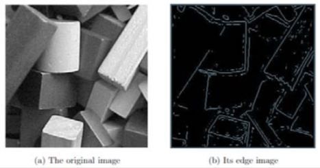
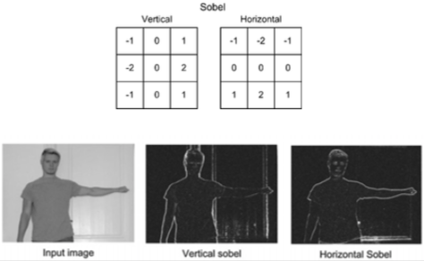
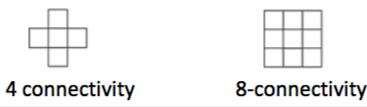

+++
title = 'Image processing'
+++
# Image processing
Problems:
1. Acquired signals are often noisy
2. Context information is often hidden

Below are options for image processing.

[Point processing](./point-processing)

[Neighborhood processing](./neighborhood-processing)

[Morphological operations](./morphological-operations)

## Windowing
Select a region of interest — user defined region within the image.
Then crop (resize) the image.

## Segmentation
Partitioning an image into separate objects, main vs background.
Can be done by:

- Edge detection
    - edge — local discontinuity in pixel value that exceeds given threshold
    - consists of creating binary image where non-background pixel values are object boundaries

    

    - can be obtained by correlation with a kernel
        - Prewitt
        - Canny
        - Sobel

        

## BLOB analysis
BLOB — binary large object (group of connected pixels in binary image)

connectivity decides which pixels are neighbours (4-connectivity, 8 connectivity)

set of allpixels which are connected to a given pixel is a connected component or BLOB

extracting connected components is called labelling, each connected component is given a label.

0 is background, then 1,2,3,…

in MATLAB, bwlabel returns matrix with labels and number of BLOBs
