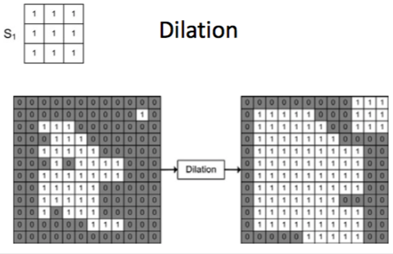
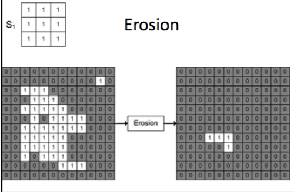

+++
title = 'Morphological operations'
+++
# Morphological operations
Useful for analysing shapes in images
Used on binary images

Operates by applying a kernel (structuring element of 0 and 1) to each pixel in input

there is a designated center pixel

instead of multiplication/addition, it is applied using a hit (dilation) or fit (erosion) operation

procedure:
1. Structuring element is placed on top of image
2. Center of structuring element is placed at position of pixel in focus
3. The value of that pixel is calculated by applying structuring element

operations

- dilation (increase in size) — center structuring element on each 0 pixel in image. if any in neighbourhood is 1, pixel is switched to 1.

- erosion (decrease in size) — center structuring element on each 1 pixel in image. if any in neighbourhood is 0, pixel is switched to 0.

- opening (erosion => dilation) — removes small, isolated noisy objects
- closure (dilation => erosion) — removes small hole and join narrow isthmuses between objects
