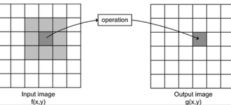
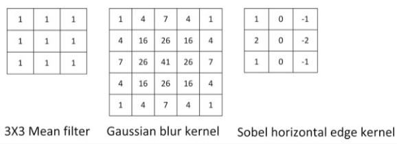

+++
title = 'Neighborhood processing'
+++
# Neighborhood processing
Value of pixel in output is determined by value of same pixel in input and the neighbours.

Use small neighbourhood of pixel in input to get new brightness value in output.

## Filtering (applying filter or mask to entire image):

- Mean filter — replace noise pixel by mean value of neighbours, including itself
- Median filter — order values in increasing order including itself, find median, set that as new value

## Correlation/convolution in an image:

- works by scanning through image and applying mask (“kernel”) to each pixel
- kernel is filled with numbers, not always equal to one (“kernel coefficients”)
- coefficients weigh pixel value they are covering
- output of correlation is sum of weighted pixel values
- kernel alters center pixel
- decreases size of image!

example kernels:

