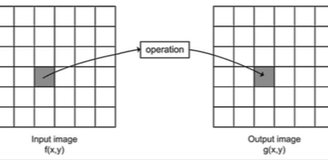
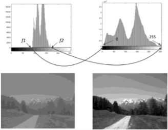
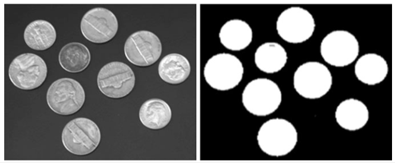

+++
title = 'Point processing'
+++
# Point processing
A simple function applied to each value — e.g. to lighten, y = x+C

Ex: change brightness of every pixel in the same way



```
b = imread(‘filename.bmp’);
b1 = imadd(b,128);
```

## Type conversion
From RGB to grayscale (24 bits -> 8 bits)

```
I = imread(‘filename.bmp’);
J = rgb2gray(I);
```

## Histogram stretching

A histogram graphs the amount of times each value from 0 to 255 occurs in an image.

You can stretch a histogram to equalise the image



## Thresholding

- a gray scale image can be converted into binary (B&W)
- choose a grey level T (threshold), change each pixel based on relation to T
- white if >T, black if ≤T


