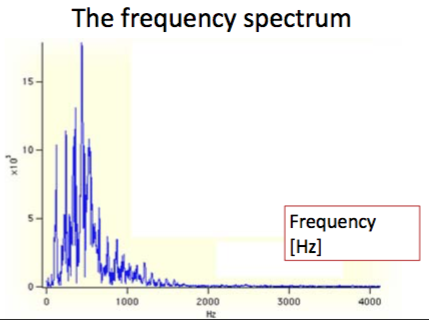
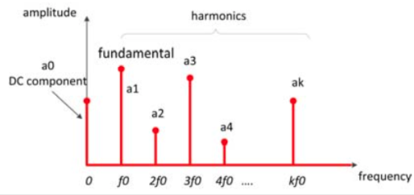
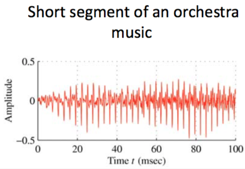
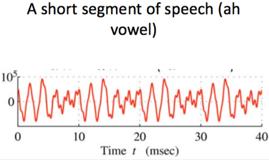
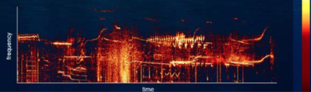
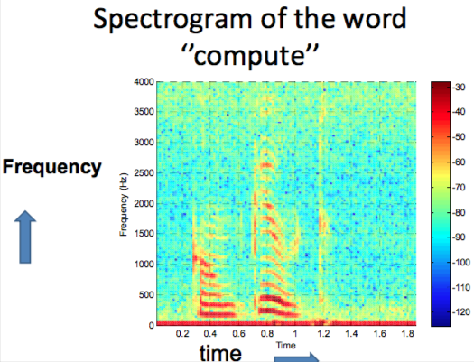

+++
title = 'Sound processing'
template = 'page-math.html'
+++
# Sound processing
Problems with sound capture:
1. Acquired signals are very noisy
2. Context information is hidden

How do we process sound to classify and extract information?

Basic features of sound

- Volume (air pressure) or loudness (dB) — amplitude of wave
- Frequency (Hz) or pitch — frequency of wave

## Periodic signal — Fourier

When the signal is sinusoidal, it’s simple to calculate the frequency with a physics formula.

But if it’s not sinusoidal, what do you do? Analyse frequency spectrum. Enter Fourier.

Fourier: almost every signal can be broken down into multiple sinusoidal waves with different frequencies and amplitudes.

Instead of having signal amplitude as function of time, represent it by function of frequencies.

Then you end up with a Fourier series — sum of simple sinusoidal waves with frequencies kf₀, amplitudes Ak and phase shifts φk:

$x(t) = A_{0} + \sum_{k=1}^N A_{k} \sin (2 \pi k f_{0} t + \phi_{k})$

The periodic signal has a frequency spectrum of various harmonics:

Component frequencies are a multiple of the fundamental frequency, called harmonics.

You can calculate amplitudes Ak with an algorithm called FFT (Fast Fourier Transform), in a vector.

You put in the vector of samples and the number of samples N, and you get out a vector of amplitudes of length N+1

- First element is DC component with frequency 0
- You can really only use the first half of the vector

Formulas:

<table>
<tr><td>Frequency step</td>
<td>Frequency at amplitude</td>
<td>Nyquist frequency</td>
<td>Last useful amplitude</td>
</tr>
<tr>
<td>$\Delta f = \frac{F_s}{N}$</td>
<td>$f_{k} = k \Delta f = \frac{kF_{s}}{N}$</td>
<td>$F_{s}/2$</td>
<td>$f_{N/2} = N/2 \Delta f$</td>
</tr>
</table>

Nyquist frequency (fc): maximum freq. detected using FFT; half sampling rate Fs.

## Not periodic — short time analysis
some sound signals are periodic for a very short time

Cut the speech in segments (frames). Then you can apply FFT on those pieces.
This is called segmentation or windowing.

### Spectrogram
Freq. spectrum varies in time

Graph with time on x-axis, frequency on y-axis and colour being amplitude of each frequency

### Digital filtering
Time domain: moving average filter
Frequency domain:

- Low-pass
- High-pass
- Band-pass — allow only a certain frequency band
- Band-reject (notch-filter) — allow everything but a certain frequency band
    - sample signal, compute spectrum using FFT, set to zero portions of spectrum that are just noise, and inverse FFT to synthesise improved signal
