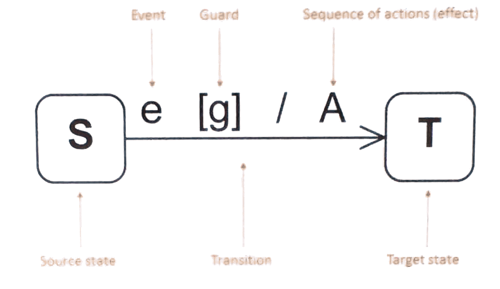
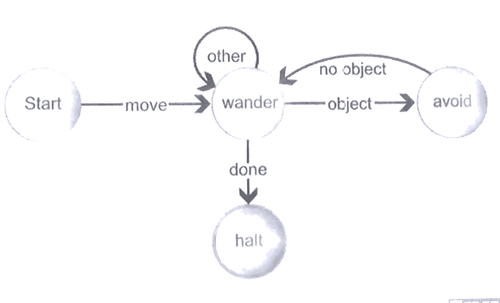

+++
title = 'Systems engineering'
+++
# Systems engineering

State transition diagrams

- changes in state happen as result of events

e.g. robot that avoids obstacles:

Activity diagrams

- rounded rect for events
- diamonds for decisions
- black ovals for start/stop
