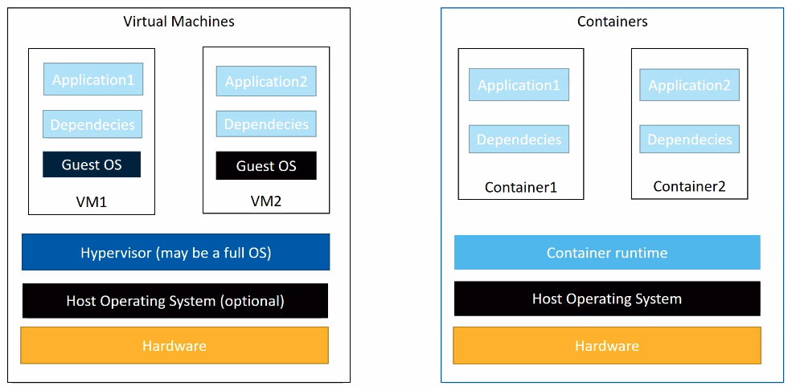
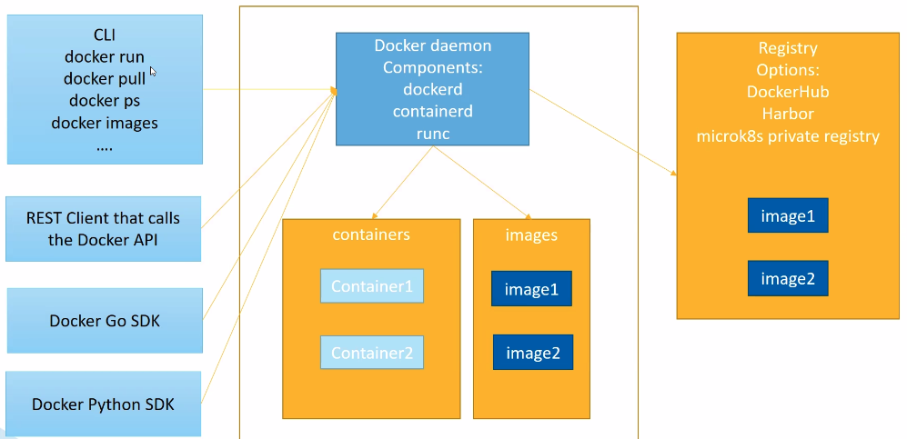
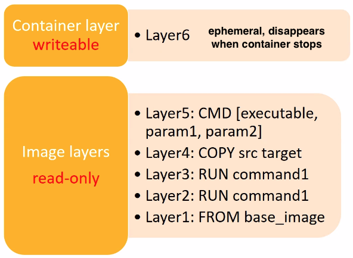

+++
title = 'Introduction'
+++
# Introduction
## What are containers?
Every time you create a new VM, you carry over a guest OS, which (a) consumes a lot of resources, and (b) is another attack surface for hackers.

In comparison, a container can be much smaller and lighter.

Containers vs virtual machines:

## What features in Linux enable containers?
1. Control groups (cgroups): used to limit usage of resources by processes
   - OOM killer kills processes when memory gets exhausted
   - cgroups can be controlled with filesystem at `/sys/fs/cgroup`
   - every PID represented once in each hierarchy
2. Namespaces: mechanisms allowing separation/isolation of resources that would otherwise be in global scope. can see them in `/proc/PID/ns`, or with `lsns` (in `util-linux` package)
   - mount namespace
   - interprocess communication (message queues, semaphores, shared mem)
   - unix time sharing (isolates hostname and NIS domain name of a process)
   - process ID (isolates process ID number space)
   - network
   - user ID
   - control group
   - time
3. Union filesystem: create union of the contents of different filesystems. used to isolate changes to container filesystem in its own layer, and avoid duplicating complete set of files every time you run an image as a new container.

## Kubernetes
Distributed system, made of group of master nodes and one or more worker nodes, which run containers grouped in pods.

## OCI: Open Container Initiative
Provides two specifications:
- container runtime specification:
  - defines how:
    - to download an OCI image
    - to unpack that image into an OCI Runtime "filesystem bundle"
    - the OCI Runtime runs the "filesystem bundle"
- image format specification
  - defines how to create an OCI image, resulting in:
    - image manifest: metadata about contents and dependencies of image
    - filesystem (layer) serialization
    - image configuration (app arguments, environments, etc.)

## Container runtimes
Container Runtime Interface (CRI): lets a kubelet use different container runtimes without having to recompile.

Example runtimes: containerd, CRI-O, docker

## Docker
### Ecosystem
- Docker Engine: client-server app (server with daemon `dockerd`, APIs to talk to daemon, CLI client), swarm mode to natively manage a cluster of Docker Engines
- Docker Compose: tool to define and run multi-container Docker apps, using YAML files
- Docker Desktop: app that lets users build and share containerised apps
- Docker Hub: repo for container images

### Engine architecture

### Image architecture
Docker images have layers, and are built from declarative Dockerfiles.
Most commands in Dockerfile result in new layer being added.
After docker build the image, all layers are read-only.
When docker _runs_ the image, it adds a new writable layer, and any created/modified files are lost when the container stops.

Dockerfile:
- must begin with FROM statement, pulls base image from a registry
- every RUN statement executes series of commands that create new layer
- the COPY statement copies external files into container (also creates a layer)
- the EXPOSE statement indicates on which port to listen, but does not publish the port
- the CMD statement provides default command for container at runtime

### Copy-on-Write (CoW) strategy
- read access: if layer needs read access to a file in lower layer, it uses the file directly
- write access: if a layer needs to modify file in lower layer, the file is copied into the layer that needs to use it, and then modified
- layer reuse: when you pull image from a repo, all layers are pulled separately, and if one already exists locally, it's used from the cache without pulling it again

### Docker-compose
Lets you orchestrate multiple containers, including setup of networking between them.
Containers are described in docker-compose file, using YAML.

### Persistent storage
You have a few options:
- volumes:
  - stored in a part of the host FS which is managed by Docker (`/var/lib/docker/volumes/` on standard GNU/Linux)
  - should not be modified by non-docker processes
  - use `docker volume create`, or during `docker run`, or in a docker-compose file
- bind mounts: map folder on host to folder inside container
  - can be stored anywhere on host FS
  - can be modified by other processes

`tmpfs` is not persistent, only stored in memory. useful to temporarily store sensitive files.

### Networking
By default, docker creates 3 networks: bridge, host, none.
When you start a container, it's attached to default bridge network.

Bridge default network:
- each container has its own IP address in subnet defined by default bridge network
- two containers refer to each other via IP
- not recommended for production
- inspect with `docker network inspect bridge`

User bridge networks:
- create with `docker network create <name>`
- uses different subnet: 172.22.0.0/16

Connect an existing container to a network with `docker network connect <network-name> <container-name>`

When containers are part of same user defined bridge network, they can refer to each other both via IP and via container name ("automatic service discovery").

You can connect a container to the host network, at which point it's not isolated from the host network.
