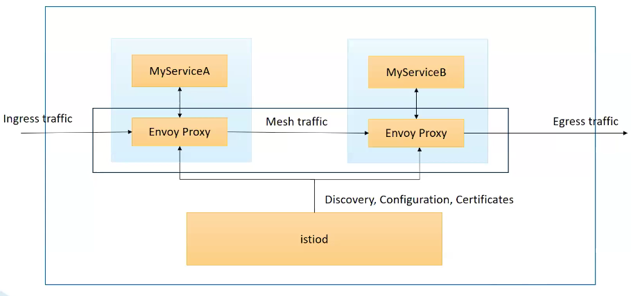

+++
title = 'Istio'
+++

# Istio
Istio is a service mesh.
Provides:
- ingress gateway to config access to services of Cluster without configuring ROutes
- virtual services to create routing rules, which you could use for e.g. configuring A/B testing
- security: cert management, authentication policy, authorization policy
- observability: metrics, distributed traces, access logs

Istio architecture:

Can enable in microk8s with `microk8s enable istio`.
Needs a LoadBalancer, so install metallb.

Istio provides a CLI: `istioctl`.

Prometheus is used to collect metrics.
