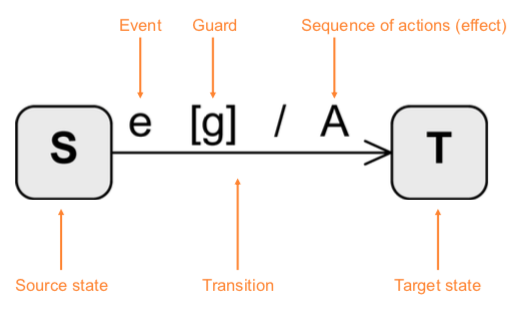
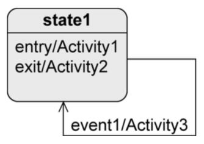
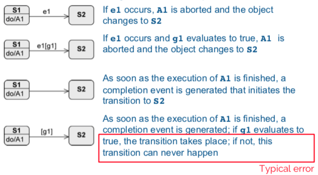
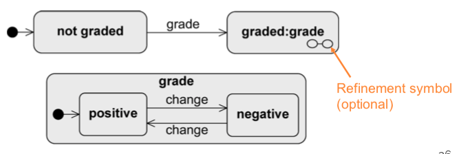

+++
title = 'Modeling behavior with UML State Machines'
+++
## Modeling behavior with UML State Machines
### Introduction
every object has finite set of states during life.

state machine diagram is used to:
* model possible states of system/object
* show how state transitions occur as consequence of events
* show behavior of system in each state

### States
states are the nodes of state machine

when a state is active:
* object is in that state
* all internal activities in that state can be executed:
    * `entry/Activity` - when object enters the state
    * `do/Activity` - while object remains in this state
    * `exit/Activity` - when object exits the state

### Transitions
change from one state to another

Syntax of transitions:

* Event (trigger)
    * can trigger state transition
* Guard (condition)
    * boolean expression
    * if event occurs, guard is checked
    * if guard is true:
        1. all activities in current state are terminated
        2. exit activity is executed
        3. transition happens
* Activity (effect)
    * sequence of actions that happen during transition

Types:
* internal:

    

    * if `event1` happens, object stays in `state1` and `Activity3` runs

* external:

    

    * if `event1` happens:
        * object leaves `state1`, `Activity2` runs
        * `Activity3` runs
        * object enters `state1` and `Activity1` runs

Timing of transitions:

### Types of events
* *Signal event:* receipt of a signal (`rightmousedown`, `sendSMS(message)`)
* *Call event:* operation call (`occupy(user, lectureHall)`, `register(exam)`)
* *Time event:* time-based state transition (relative or absolute time)
* *Any receive event:* when any event occurs that doesn't trigger another transition from the active state
* *Completion event:* automatic when everything is completed in the current state
* *Change event:* permanently checking when a condition becomes true

A change event is permanently checked. A guard is only checked when the event occurs.

### Types of states
Initial state:
* "start" of the diagram
* pseudo-state, system can't remain in this state
* no incoming edges
* outgoing edges have to be mutually exclusive and at least one target must be reachable. no events allowed.
* system immediately switches from initial state.
* notation: 

Final state:
* real state
* end of sequence of states
* can remain in this state forever
* notation: 

Terminate node:
* pseudo-state
* terminates state machine
* modeled object is deleted
* notation: 

Decision node:
* pseudo-state
* used for alternative transitions
* notation: 

Parallelization node:
* pseudo-state
* splits control flow into multiple concurrent flows
* 1 incoming edge, >1 outgoing edges
* notation: 

Synchronization node:
* pseudo-state
* merges multiple concurrent flows
* >1 incoming edge, 1 outgoing edge
* notation: 

Composite state:
* contains substates, with only one of them active at any time
* arbitrary nesting depth
* higher level events take priority

Orthogonal state:
* composite state divided into two or more regions, separated by dashed line
* one state of each region is always active at some point (concurrent substates)
* final state has to be reached in all regions to trigger completion

Submachine state (SMS)
* to reuse parts of state machine diagrams in other ones
* as soon as submachine state is activated, behavior of submachine is executed (subroutine)
* notation: `state:submachineState`

History state:
* remembers the last active substate of a composite state
* activates 'old' substate and all entry activities run sequentially from outside to inside of composite state
* exactly one outgoing edge of history state points to a substate. used if the composite state was never active, or it was exited via final state.
* shallow history state restores state on the same level of the composite state (`H`)
* deep history state restores last active substate over _all levels_ (`H*`)

### Entry and exit points
Encapsulation mechanism: a composite state shall be entered/exited via a state other than initial and final states.

external transition must/need not know structure of composite state.

