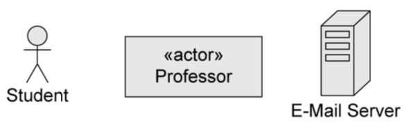
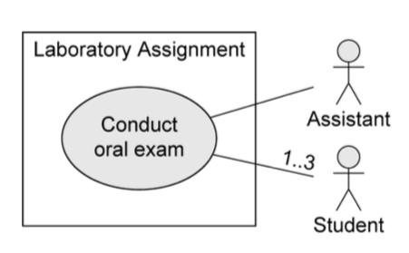

+++
title = 'Requirements engineering with UML'
+++
## Requirements engineering with UML

### What is UML?
A unified modeling language, the defacto standard for software design.

pros:
* not tied to a development process
* can be used across the whole life cycle
* general purpose, can model all sorts of shit
* has different representations (graphical, but also text)

main characteristics:
* comprehensive: can describe all parts of a system
* scalable: "zoom in" and add more details if you want
* originally intended for descriptive models
* now also supports prescriptive models

formal modeling language — its core concepts have a well-defined meaning

UML model is represented graphically with diagrams

The different types:

The ones we will use:
* use case diagram: to specify the basic functionality of a software system (requirements)
* class diagram: to define data structures within the system
* state machine diagram: to define intra-object behavior
* sequence diagram: to specify inter-object behavior and communication

a UML _model_ contains everything related to the system. a _diagram_ is just a "window" on the model (shows some parts, but not necessarily everything).

### Requirements engineering
the process of establishing:
* features that a system should and will have
* constraints under which it operates and is developed

requirement can range between:
* high-level abstract statement of a feature
* detailed mathematical functional specification

functional (what) vs non-functional (how) requirements
* functional: services the system should provide, how it should react to inputs, how it should behave in specific situations, opt. what it shouldn't do.
    * precise — ambiguous requirements may be interpreted in different ways by developers and users
    * complete — they should include descriptions of _all_ facilities required
    * consistent — there should be no conflicts or contradictions in descriptions of system facilities
    * verifiable — requirements should be directly mapped to parts of system
* non-functional: constraints on services/functions offered by the system, often apply to system as a whole instead of individual features/services
    * system properties and constraints (e.g. reliability, response time, storage requirements)
    * may be more critical than functional, like safety requirements
    * may affect overall architecture of a system instead of individual components (like organization to minimize communications between robots)
    * different types:

    

in UML: use case diagrams for functional requirements.

How to write requirements specifications:

| *Notation*                   | *Description*                                                                                                                                   |
|------------------------------|-------------------------------------------------------------------------------------------------------------------------------------------------|
| Natural language             | Use numbered sentences in natural language. Each sentence is one requirement.                                                                   |
| Structured natural language. | Requirements are written in natural language on standard form/template. Each field gives info about an aspect of the requirement.               |
| Design description languages | Use language like programming language, but with more abstract features specifying requirements by defining an operational model of the system. |
| Graphical notations          | Graphical models with text annotations. e.g. UML use case and sequence diagrams.                                                                |
| Mathematical specifications  | Based on math concepts like finite-state machines or sets. Most customers don't understand this so not often used.                              |

#### Natural language specification
requirements are written as natural language sentences. used because it's expressive, intuitive, universal, easily understood by customers.

guidelines:
* invent a standard format, use it for all requirements.
* use language in a consistent way ("shall" for mandatory requirements, "should" for desirable requirements)
* highlight text to identify important parts of requirement
* avoid use of computer jargon
* include explanation (rationale) of why a requirement is needed

#### Use case diagrams
express expectations of customers/stakeholders.

answers questions:
* what is being described? (the system)
* who interacts with the system? (the actors)
* what can the actors do? (use cases)

use case:
* describes functionality expected from system under development
* set of all use cases describes functionality that a system shall provide.
* notations:

actors:
* interact with the system by using use cases, or by being used by use cases.
* represent roles that users adopt (users can have multiple roles)
* not part of the system, so outside of system boundaries.
* human or non-human
* primary/secondary:
    * if primary, has main benefit of execution of use case.
    * if secondary, receives no direct benefit.
* active or passive
    * active: initiates execution of the use case
    * passive: provides functionality for the execution of the use case

relationships between use cases and actors:
* actors are connected with use cases via associations (solid lines)
* every actors has to communicate with at least one use case
* association is always binary, multiplicities can be specified

relationships between use cases:
* «include»
    * behavior of one use case ('included') _is always_ integrated in the behavior of another use case ('base')

    
* «extend»
    * behavior of one use case ('extending') _may be_ integrated in behavior of another use case ('base')
    * both use cases can also be executed independently of each other
    * extension points are written directly in the use case. you can specify multiple extension points.

    
* generalization of use cases
    * if use case A generalizes use case B, then B inherits behavior of A and may extend/overwrite it. B also inherits all relationships form A.
    * A may be labeled {abstract} — cannot be executed directly, only B is executable

    

relationships between actors
* generalization
    * actor A inherits from actor B. e.g. A can communicate with X and Y, B can only communicate with Y.
    * abstract actors are possible

    

Description of use cases:
* Name
* Short description
* Precondition: prerequisite for successful execution
* Postcondition: system state after successful execution
* Error situations: errors relevant to problem domain
* System state on occurrence of an error
* Actors that communicate with the use case
* Trigger: events which initiate the use case
* Standard process: individual steps to be taken
* Alternative processes: deviations from the standard process

Remember, it's an abstraction. Many small use cases with the same objective should be grouped. Don't decompose functionality into use cases.

### Summary of notation

