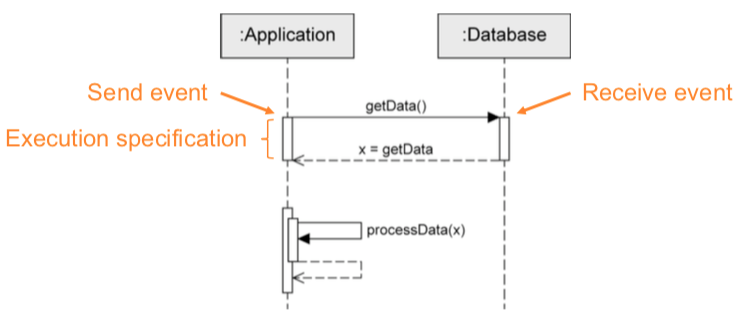
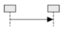
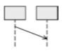
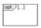
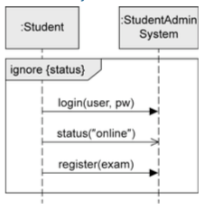
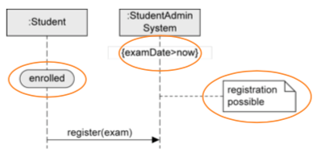

+++
title = 'Sequence Diagrams'
+++
## Sequence Diagrams
### Introduction
it's a way to model interactions between objects

interaction specifies how messages and data are exchanged between objects

interaction partners: human (lecturer, admin) or non-human (server, printer, software)

interactions: conversation between people, message exchange between human and software, communication protocols, sequence of method calls in program, etc.

### Basics
#### Interactions, interaction partners
a sequence diagram is 2D:
* horizontal axis: involved interaction partners
* vertical axis: chronological order of interaction

interaction: sequence of event specifications

interaction partners are lifelines:
* head of lifeline is rectangle containing `object:Class`
* body of lifeline is vertical dashed line representing lifetime of associated object

#### Messages
message is defined via send and receive events

execution specification (optional):
* continuous bar
* used to visualize when interaction partner executes a behavior

rules:

synchronous message:
* sender waits until it has received response message before continuing
* syntax: `msg(par₁, par₂)`
    * `msg`: name of message
    * `par`: parameters
* notation: 

asynchronous message:
* sender continues without waiting for response msg
* syntax: `msg(par₁, par₂)`
* notation: 

response message:
* can be omitted if content and location are obvious
* syntax: `att = msg(par₁, par₂): val`
    * `att`: return value assigned to variable (optional)
    * `msg`: name of message
    * `par`: parameters
    * `val`: return value
* notation: 

object creation:
* dashed arrow, arrowhead pointing to head of lifeline of object that's being created
* keyword `new`
* notation: 

object destruction:
* object is deleted
* large cross at end of lifeline
* notation: 

found message:
* sender unknown/not relevant
* notation: 

lost message:
* receiver unknown/not relevant
* notation: 

Time-consuming message:
* message with duration
* usually messages transmitted instantly (by assumption); not in this case
* notation: 

### Combined fragments
model various control structures, have 12 predefined operators.

Example:

#### Branches & loops
`alt`:
* alternative sequence
* like a switch statement, with guards selecting the path to be executed
* guards modeled in square brackets, default true
* guards have to be disjoint so that behavior is deterministic!

`opt`:
* optional sequence
* like an if without an else
* actual execution depends on guard
* exactly one operand

`loop`:
* repeated sequence
* min/max number of iterations - `(min..max)` or `(min, max)`. default `(*)`, no upper limit.
* guard evaluated when min number of iterations took place, checked on each iteration. loop quits if false.

`break`:
* exception handling
* one operand with a guard. if true:
    * interactions within operand are executed
    * remaining operations of _surrounding_ fragment don't run
    * interaction continues at next higher level fragment (so like you skip a level)

#### Concurrency and order
`seq`:
* weak sequencing, default order of events
* can't skip around on the same lifeline

`strict`:
* strict order
* fixed sequence of events across lifelines
* order of events on different lifelines between different operands is significant
* messages in operand higher up on vertical axis are _always_ exchanged before the ones that are lower

`par`:
* concurrent interaction
* relax chronological order between messages in different operands
* restrictions in each operand have to be respected
* order of different operands is irrelevant

`critical`:
* atomic interaction
* make sure that certain parts of interaction aren't interrupted by unexpected events
* _always_ has to be in that order

#### Filters and assertions
`ignore`:
* irrelevant interaction
* messages can occur at runtime but don't have other significance
* one operand, irrelevant messages in curly brackets after keyword `ignore`

`consider`:
* relevant interaction with a particular importance
* one operand. "dual" to ignore fragment
* considered messages in curly brackets
* and yes, you can use `ignore` instead of `consider` and vice-versa

`assert`:
* asserted interaction
* mandatory interactions. the model is complete. can't have any deviations.

`neg`:
* invalid interaction
* describe situations that must not occur
* depicting relevant but _incorrect_ sequences

### Further language elements
time constraints:
* point in time for event occurrence: `after(5sec)`, `at(12.00)`
* time period between two events: `{lower..upper}`
* `now`: current time
* duration: calculation of duration of message transmission

Interaction reference:
* integrates one sequence diagram in another sequence diagram
* define with `sd name` in the corner, then use the name in the diagram with `ref` in the corner

Gate:
* allows to send and receive messages beyond boundaries of interaction fragment

state invariant:
* asserts certain condition has to be true at certain time
* if state invariant is not true, either model or implementation is wrong
* notations:

