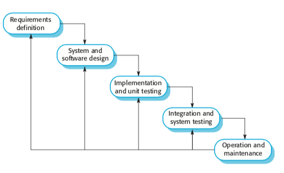

+++
title = 'Software development process'
+++
## Software development process

main activities:
* requirements engineering
    * specifies the main functionalities of the system
    * defines the qualities to be met
* design
    * give shape to a system via models
    * not a clear-cut sequential process
* implementation and testing
    * involves actual development of the system
    * component testing – test individual components independently
    * system testing – test the system as a whole (including emergent properties like overall performance)
    * acceptance testing – test with customer data to see if the system meets the customer's needs
* evolution
    * software is inherently flexible and can change

### Waterfall development process

exists in many variants, all with sequential flow. it's document-driven.

issues: poor agility (when do you know how far you are in the project?), poor quality (cuts if you run out of time), high risk (finding issues in test phase)

critical evaluation:
* positive:
    * precise planning and management – standard-oriented
    * postpone implementation to after understanding objectives
    * good documentation
* negative:
    * hard to get all requirements once and for all (users might not even know what they want)
    * rigid
    * no feedback from the customer
    * no parallelism, all phases are blocking (because sequential)
    * a single delivery date at the end

### Agile development process
iterative development processes with:
* frequent releases of the product
* continuous interaction between dev team and customer
* reduced product documentation
* continuous and systematic assessment of produced value and risks

agile in practice:
* make a list
* estimate
* set priorities
* start executing
* update the plan at run time

critical evaluation:
* positive:
    * acceptance of change – less risky
    * frequent and short iterations
    * emphasis on working code
    * associates a test with every piece of functionality
    * continuous integration and delivery
* negative:
    * feature-based development & ignorance of dependencies
    * no strong quality plan
    * less focus on architecture of system (in fact, dismisses everything that isn't shippable)

