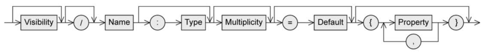
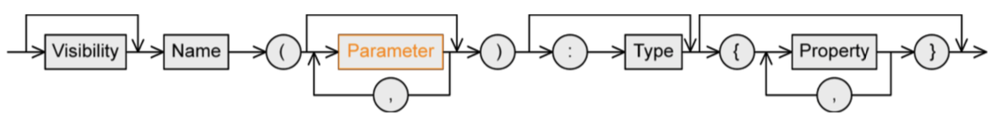
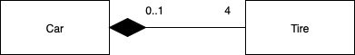
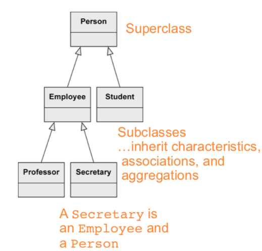
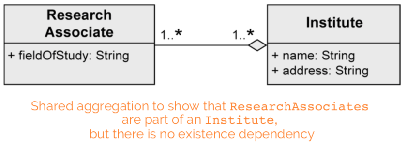
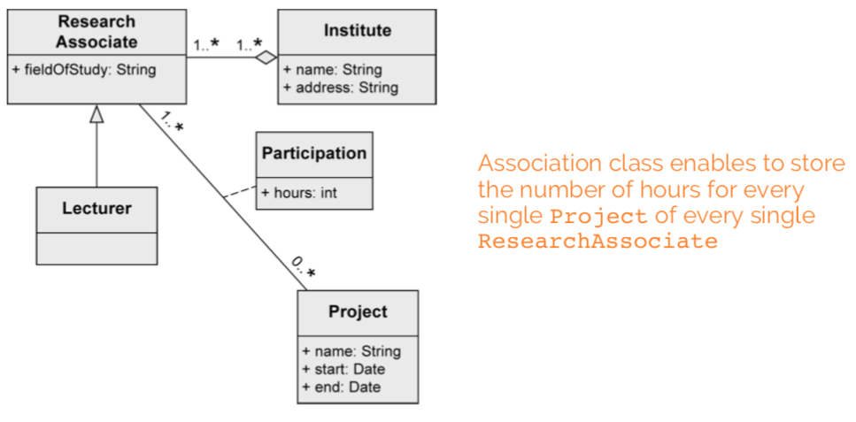

+++
title = 'Structure modeling with UML'
+++
## Structure modeling with UML

### Class

a construction plan for a set of similar objects of a system


#### Attribute syntax



Visibility: who is permitted to access the attribute
* `+` public, everybody
* `-` private, only the object itself
* `#` protected, class itself and subclasses
* `~` package, classes that are in the same package

`/` means that attribute value is derived from other attributes

Type:
* primitive data type
    * pre-defined: Boolean, Integer, UnlimitedNatural, String
    * User-defined: «primitive»
    * composite: «datatype»
* enumerations: «enumeration»


Multiplicity: number of values an attribute may contain (as [min..max], max can be `*` meaning no limit)

`= Default`: the default value that's used if the user doesn't explicitly set a value

properties:
* `[readOnly]` - value can't be changed
* `[unique]` - no duplicates allowed
* `[non-unique]` - duplicates allowed
* `[ordered]` - fixed order of values
* `[unordered]` - no fixed order of values

#### Operation syntax



Similar to attributes.

parameter:
* direction
    * `in`: input parameter (value is expected)
    * `out`: output parameter (adopts a new value after execution of operation)
    * `inout`: combined input/output


type: type of return value

#### Class variable and class operation
Class variable (static): defined only once per class, shared by all instances

Class operation (static): can be used without creating an instance

To distinguish class variables/operations, underline them.

### Relationships

#### Binary association
Connects instances of two classes with one another.


Properties:
* Navigability: an object knows its partner objects, can access their visible attributes and operations (open arrow head, if not then cross). If undefined, bidirectional is assumed.
* Multiplicity: number of objects that can be associated with exactly one object of the opposite side (e.g. one-to-one, one-to-many...)
* Role: how an object is involved in an association relationship
* `xor` constraint: cannot be associated with both at the same time

in Java:

```java
class Professor {...}

class Student {
    public Professor[] lecturer;
}
```

#### n-ary association
More than two objects involved in the relationship, no navigation directions.


#### Association class
Assign attributes to relationship between classes instead of to a class.


Needed for n:m associations.

Association class vs regular class:


Can be unique or non-unique.

#### Aggregation
Shows that class is part of another class.

Properties:
* transitive: if B is part of A and C is part of B, C is also part of A
* asymmetric: not possible for A to be part of B and B to be part of A at the same time

##### Shared aggregation
expresses weak belonging of the parts to a whole (parts also exist independently of the whole). one element can be part of multiple other elements at the same time.

Example:


##### Composition
existence dependency between composite object and its parts. one part can be contained in max one composite object at a point in time. if the composite object is deleted, so are its parts.

A `Tire` can exist without a `Car`. A `Tire` belongs to max one `Car`:



#### Generalization
stuff from a superclass is passed to its subclass (attributes, operations, associations, aggregations)

every instance of a subclass is simultaneously an indirect instance of the superclass. subclass inherits all characteristics except private ones. generalizations are transitive. a class may have multiple superclasses/subclasses.



abstract class ensures that there are no direct instances of the superclass.


### Creating a class diagram
nouns often indicate classes. adjectives indicate attribute values. verbs indicate operations.

in general, tend towards having deep classes. push complexity as low as possible in the class diagram hierarchy.

focus on:
* responsibility of each class (private is default, `getter` and `setter` methods)
* knowledge needed by each class (tend toward generality, don't focus on order of tasks)
* usability of operations of each class (exposed APIs should be as easy and intuitive as possible

generalization: "there is difference between research and administrative employees. some research associates hold courses, so they are lecturers."


composition: "a university consists of multiple faculties which are composed of various institutes."


binary association: "each faculty is led by a dean, who is an employee of the university"


shared aggregation: "research associates are assigned to at least one institute"



association class: "research associates can be involved in projects for a certain number of hours"



generalization: "some research associates hold courses. then they are called lecturers."


