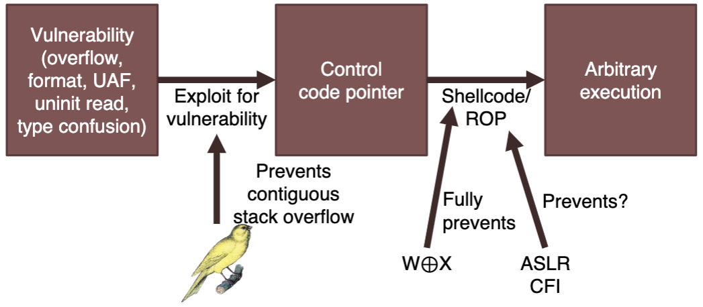
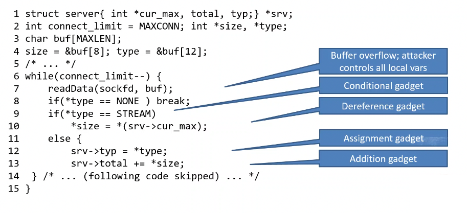

+++
title = 'Defenses and bypassing them'
+++
# Defenses and bypassing them

Techniques that can make attacks harder:
- protect sensitive data from leakage/corruption
- make using corruption for code execution harder
- detect undefined behavior

Static analysis: can we prove code never results in undefined behavior?
- incomplete due to halting problem

Dynamic instrumentation: runtime checks for undefined behavior
- negative performance impact
- false positives mean crashing a correct program



## Stack canaries
Value between local vars and return address, compiler initializes with random value in function prologue.
On return, check whether value is still the same, and crash if it isn't.

Enable with `-fstack-protector`.
`%fs:40` is randomized at thread creation, canary is never left in a register, and is moved to a position in the stack, as a local variable.

Can still exploit, if we can jump over the canary. E.g. in this example, overwrite the len variable so memcpy writes to it:

```c
void echo(int fd) {
    long len;
    char name[64], reply[128];
    /* ... */
    read(fd, name, 128);
    memcpy(reply + len, name, 64);
    /* ... */
}
```

Three approaches:
- jump over canary: corrupt pointer/index used to write memory, write target address past canary. need two writes - either two vulnerabilities or a loop.
- leaking canaries: leak canary, overwrite with same value. need leak vulnerability, ability to provide more input after leak and buffer overflow with new input.
- brute force canaries: guessing randomly out of 2⁶⁴ possibilities is impossible. but can brute force if we can corrupt part of canary, program restarts with same canary, and get feedback about crashes.
    - overflow into canary by one byte, try all values and find which is correct for first byte (doesn't crash). Try next bytes until full canary found.
    - max 8×2⁸ attempts needed

## Data execution prevention (DEP)
OS marks data pages as non-executable (no-execute bit in page tables).
- attempt to execute data (like shellcode) gives segfault

W⊕X: no memory is both writable and executable.

We can still exploit this, but no longer by jumping to own shellcode - need to reuse existing code.

Can use shared library functions (return-to-libc), or chain together parts of code (return-oriented programming).

### Ret2libc
On x86\_32, params pass on the stack, so params to function can be easily set.

In 64-bit, parameters are passed in registers, so only works if parameter is in %rdi.
Maybe reuse additional code to load desired %rdi value (e.g. with a piece of code that pops to %rdi and returns).

### Return oriented programming (ROP)
Any sequence of instructions ending in RET is a 'gadget', which can be chained together.
Return oriented programming is a chain of such gadgets.

Might want some useful ones:
- load value to register (pop)
- read from memory (mov (reg), reg)
- write to memory (mov reg, (reg))
- computation (add, sub, etc.)
- syscall

Given the right gadgets, can do arbitrary computation without any code.
Tools help generate ROP chains, e.g. [Ropper](https://github.com/sashs/Ropper)

If we run out of writable stack, build a new stack anywhere in memory (such as attacker-controlled heap memory).
Function epilogue can load stack pointer (by using it twice).
This is a "stack pivot".

If we can't find the right gadget, use libraries, especially libc.
Can jump into middle of an instruction.

## Address space layout randomization (ASLR)
Randomizes memory addresses of code, data, heap, and stack.
Prevents attacker from finding code pointer to overwrite, or knowing what to overwrite it with.

Stack and heap randomized by OS alone:
- stack: determined by %rsp, set in `execve()`
- heap: brk() and mmap() return values

Code and data require compiler support
- absolute code/data refs would break with randomized addresses
- position independent code (PIC) forces all pointers to be relative to instruction pointer
    - libraries used PIC to prevent clashes in address space
    - executables can also use PIC (`-fPIE`)

Can still be attacked:
- relative pointers don't change
- if one pointer is leaked, all others can be computed
- so leak pointers from stack/heap, or use side channels to recover complete address space

### Information hiding
ASLR: randomness limited to base:
- first shared object is loaded at random position
- next object located right below (lower addresses) the last object
- ⇒ all libraries located side by side at single random place

Shadow stack:
- move sensitive data (e.g. return address) on separate stack
- make sure shadow stack is protected
- real hiding:
    - no pointer in memory should refer to secret location of shadow stack
    - only dedicated register (e.g. `%gs:108`) points to shadow stack
- how to find it:
    - address space typically has some holes
    - don't look for hidden region, look for holes -- one larger and one smaller -- surrounding the region
    - even if we remove all pointers, we still have the size of the hole left that indicates the hidden region
    - repeatedly allocate large chunks of memory until we find the "right size": if allocation succeeds, hole it is that size or bigger. if fails, hole is smaller.
    - ephemeral allocation: allocate and free within the request
    - persistent allocation: allocate 'permanently' (can also use ephemeral and just not complete the request)
    - steps:
        1. determine large hole using ephemeral allocation
        2. allocate large hole using persistent allocation
        3. run ephemeral allocation algorithm again, giving us small hole

## Control-flow integrity
Prevent turing completeness with ROP chains.

idea:
- only allow "legitimate branches and calls"
- i.e. those that follow control flow graph
- give valid targets a label, and check that we don't branch anywhere else

May be combined with runtime shadow stack.

in practice
- requires precise CFG (from source code or debug info)
- large performance overhead
- so, coarse-grained CFI:
    - one common label for all call sires
    - one common label for all entry points

gadgets left after this:
- entry point gadget - jump to entry point and go up to next indirect call/jump
- call site gadget - jump to call site, go to the next return

### Data oriented programming
Perfect CFI means CFG is never violated.
But, data guides code through CFG, so by manipulating data we change control flow.

Attacker can overwrite data e.g. using buffer overflow, and overwritten data drives a dispatching data
- loop executes as often as attacker wants
- loop performs several operations, providing gadgets
- attacker controls values and pointers used in the operations



Approach:
- find gadget dispatcher (attacker-controlled loop)
- identify and classify gadgets
- convert workload into a sequence of gadget operations
- build a sequence of buffers to trigger those operations
- send the buffers to the target machine

## Sanitizers
Fully detect or mostly detect particular vulnerabilities.
Big performance overhead, so not really used in production settings, but useful for debugging and testing.

Sanitizers in GCC/LLVM
- ASan: buffer overflow, memory leak, use-after-free
- Leak sanitizer: memory leaks
- TSan: race conditions
- UBSan: undefined arithmetic
- MSan: uninitialized read

Address sanitizer (ASan):
- detects buffer overflow and use-after-free
- shadow memory tracks allocation status:
    - add check before memory access
    - shadow addr = (addr >> 3) + offset
    - red zones between allocations
    - deallocated memory in quarantine
- drawbacks: compatibility (if program depends on memory layout), performance, incomplete (no overflows in structs, misses overflows that jump over read zone, use-after-free still possible with memory massaging)

Memory sanitizer (MSan):
- detects uninitialized reads
- loading values allowed
    - uninitialized status tracked in shadow memory
    - 1-y-1 per-bit shadow mapping
    - allocation: memory poisoned
    - computation: poison propagated based on operation
- poison checked at: conditional branches, syscalls, pointer derefs

### Research topics
Delta pointers: fast buffer overflow detection
- tagged pointers use some pointer bits for metadata
- checks are implicit using MMu
- cannot detect all cases (like underflow), but much better performance

SafeInit: automatically initialize to zero
- compiler: every local variable
- allocator: every heap allocation
- optimizations:
    - only close to first use
    - only one byte for strings
    - dead store elimination: prevent initializations that are later overwritten in all cases
    - rely on OS zeroing for large heap allocations

DangSan: prevents use after free
- invalidates dangling pointers
- keep list of pointers to each object
- on pointer assignment: keep track of new pointer to object
- free: set most significant bit of remaining pointers
- complications:
    - which object does pointer point to? use shadow memory
    - what if multiple threads copy pointers to same object? use lock-free data structure (it's a write-mostly workload, so use per-thread append-only log)

Type-after-type
- allow dangling pointers, but only to same type
- separate heap and stack for each type
    - never reuse memory used for one type for another
    - dangling pointer keeps pointing to same type
- challenge: type inference
    - use static analysis to guess from context
    - explicit type on stack and with new operator, trace result to pointer cast, or sizeof in malloc size

TypeSan
- type confusion mitigation requires knowing runtime type of object on static_cast
- use shadow memory, translate each pointer to set of allowable casts (which is determined at compile time)
